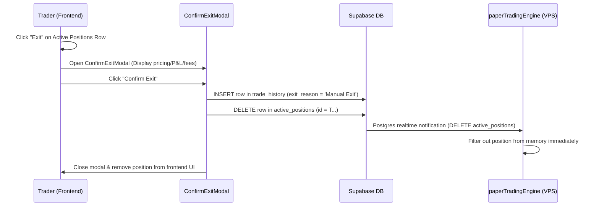
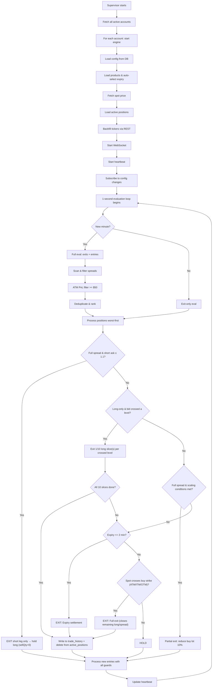

# Paper Trading Engine — Complete Logic Explained

This document explains **every** logic and condition in the Paper Trading engine in the simplest terms possible, from startup to shutdown.

---

## Table of Contents

1. [The Big Picture](#the-big-picture)
2. [Strategy Versioning (Paper vs Live)](#strategy-versioning-paper-vs-live)
3. [Multi-Account Supervisor](#multi-account-supervisor)
4. [Engine Startup (Boot Sequence)](#engine-startup)
5. [The Heartbeat (1-Second Loop)](#the-heartbeat)
6. [How Spreads Are Found (Scanning)](#how-spreads-are-found)
7. [Entry Filters (What Makes a Good Spread)](#entry-filters)
8. [How Entries Are Placed](#how-entries-are-placed)
9. [Exit Priority Tree](#exit-priority-tree)
10. [Partial Exit / Scaling Logic](#partial-exit--scaling-logic)
11. [Short-Leg-Only Exit ($1.1)](#short-leg-only-exit)
12. [Long-Only Laddered Exit](#long-only-laddered-exit)
13. [Manual Exit (Liquidation)](#manual-exit-liquidation)
14. [Duplicate Exit Prevention (Idempotent Writes)](#duplicate-exit-prevention-idempotent-writes)
15. [Safety Guards Summary](#safety-guards-summary)
16. [Diagnostic Logging (0 Candidates)](#diagnostic-logging-0-candidates)
17. [Config Synchronization](#config-synchronization)
18. [Time-Based Filter Schedules](#time-based-filter-schedules)
19. [Frontend Dashboard Architecture](#frontend-dashboard-architecture)

---

## The Big Picture

Think of the engine as a **robot trader** that runs 24/7 on a server. It:

1. Watches live Bitcoin/Ethereum option prices via WebSocket
2. Every **1 second**, checks if any existing positions need to be exited or scaled
3. Every **1 minute**, also looks for new positions to enter
4. Writes everything to a Supabase database so the UI dashboard can display it in real time

The strategy is a **ratio spread** — you buy 1 option (the long/buy leg) and sell multiple options at a different strike (the short/sell leg). The goal is to collect more premium from selling than you pay for buying.

---

## Strategy Versioning (Paper vs Live)

**Column**: `paper_trading_config.strategy_version` (default `1`) · **Migrations**: `018`, `019`, `020`

The strategy logic is one shared codebase, but a per-account **`strategy_version`** flag lets experimental changes (new filters, changed entry/exit rules) run on **paper** accounts without touching **live** accounts:

- **Live accounts → version 1 (stable).** They only ever run logic that has already been validated.
- **Paper accounts → version 2 (experimental testbed).** New logic lands here first.

Both the **engine** (behaviour) and the **UI** (which controls are shown) branch on the **same** value — the engine reads `config.strategyVersion`, the dashboard reads it off the loaded config — so a v2-only feature neither runs nor appears on a v1 (live) account.

**Adding a versioned change**: branch only where behaviour actually diverges; everything else stays shared.

```js
if (config.strategyVersion >= 2) { /* new experimental logic */ }
else { /* stable logic — live accounts run this */ }
```

**Promotion (paper → live)**: once validated on paper, either flip a live account's `strategy_version` to `2` in the DB (a single change, no redeploy — lets you roll out to one live account first, then the rest), **or** fold the v2 code into the shared path so it becomes the new stable v1. Keep at most two generations alive (stable + experimental) and delete the old branch once every account is promoted.

> [!NOTE]
> **Current fleet policy (migration `020`)**: **all paper accounts are v2, all live accounts are v1**, and new accounts inherit this from their `mode` at creation (paper → 2, live → 1). This makes paper the experimental testbed rather than an exact mirror of live. The `strategy_version` column is kept (not replaced by a raw `mode` check) so a single live account can still be promoted to v2 independently for a staged real-money rollout.

**v2-gated features so far:**
- **Per-window Days to Expiry** (migration `019`): see filter [#9](#entry-filters) and [Time-Based Filter Schedules](#time-based-filter-schedules).
- **Trading Days (day-of-week entry filter)** (migration `021`): see [Trading Days](#trading-days-day-of-week-entry-filter).
- **Hedge Leg (per-spread 3rd long / triplet)** (migrations `022` config, `023` leg column): see [Hedge Leg](#hedge-leg--per-spread-3rd-long-long--short--long-triplet).

---

## Multi-Account Supervisor

**File**: [paperTradingEngine.js:L1414-L1500](file:///c:/Users/ASUS/Documents/Option_Scope/engine/paperTradingEngine.js#L1414-L1500)

The entry point is `startPaperTradingEngine()`. It acts like a **manager** that:

1. Fetches all active accounts from `paper_trading_accounts` table
2. Starts an **independent engine loop** for **all accounts in parallel** using `Promise.allSettled`
3. Listens for account changes in real-time:
   - **New account added** → starts a new engine
   - **Account deactivated** → stops its engine
   - **Account updated** (e.g. name or status changes) → updates the running engine's state

Each account runs in complete isolation — its own WebSocket, its own positions, its own config.

> [!TIP]
> **Parallel Startup**: All accounts start simultaneously via `Promise.allSettled`. With 10 accounts, startup time is ~3 seconds (previously ~30 seconds with sequential `for...await`). `allSettled` is used instead of `Promise.all` so that one account's startup failure does not block the others.

> [!IMPORTANT]
> **One engine per account (no duplicate evaluators).** `startAccountEngine` reserves the account **synchronously** in a `startingEngines` set *before* the `await startSingleAccountEngine(...)`. Without this, a concurrent trigger (the initial fetch, the 30-second fallback sync, or a Realtime account event) could pass the `runningEngines` check while a start is still mid-flight and spawn a **second** engine for the same account. The loser would get overwritten in the `runningEngines` map and become an **unstoppable "zombie"** — an evaluator that keeps writing every exit a second time, forever. The set is cleared in a `finally`, so a failed start is always retryable.
>
> At the **process** level the same guarantee is enforced by PM2: `ecosystem.config.cjs` pins `exec_mode: 'fork'` + `instances: 1` (never cluster-spawn a second copy) and a `kill_timeout` long enough for the outgoing process to finish its graceful shutdown before a restart. The engine must **never** run as two OS processes against the same Supabase — that reproduces the same double-booking. See also [Duplicate Exit Prevention](#duplicate-exit-prevention-idempotent-writes).

### Consolidated manual-action request poll (multi-account egress)

Manual actions — **per-leg close** (`delta_close_requests`), **order cancel**
(`delta_cancel_requests`), **Close All** (`paper_trading_accounts.close_all_requested`),
and **manual exit** (`active_positions.exit_requested`) — are polled at the **manager
level**, not per-account. A single `pollAllRequests` timer runs **up to 4 batched queries**
(one per table, filtered to all running account ids) every **1.5s** and dispatches to
each account engine's `processRequests(flags)` **only** for the request types that
actually have pending rows.

> [!NOTE]
> **Live-only queries are skipped when nothing is live (egress).** `delta_close_requests`
> and `delta_cancel_requests` only ever have work for **armed-live** accounts (their
> handlers no-op for paper). So the poll queries those two tables **only when at least one
> running account is armed-live** — and scopes them to just those account ids. A
> paper-only (or all-dry-run) deployment therefore issues just **2 queries/tick**
> (`close_all_requested` + `exit_requested`), which cover both paper and live. Manual-action
> responsiveness is unchanged (~1.5s), since the always-run pair covers every account.

> [!NOTE]
> **Why:** previously every account engine ran its own 1.5s timer firing 4 queries — i.e.
> `4 × N` queries/tick. At 18-20 accounts that was ~80 queries/1.5s (~4.6M/day) of mostly
> **empty** reads, a dominant, constant source of Supabase egress. Consolidating to 4
> batched queries/tick (~230K/day) keeps idle load **flat as accounts scale**, with the
> same ~1.5s responsiveness. After executing an action, the handler republishes the live
> snapshot immediately (see [live_trading.md](live_trading.md#manual-actions--close-all-per-leg-close-order-cancel)).

---

## Engine Startup

**File**: [paperTradingEngine.js](file:///c:/Users/ASUS/Documents/Option_Scope/engine/paperTradingEngine.js)

When an engine starts for an account, it runs these steps in order:

| Step | What Happens | Why |
|------|-------------|-----|
| 1 | **Load config** from `paper_trading_config` table (with retries) | Gets filter settings. Retries up to 10 times (500ms delay) to avoid database duplicate key race conditions during concurrent frontend config inserts. |
| 2 | **Load products** from Delta Exchange API | Gets the list of all available option contracts |
| 3 | **Auto-select expiry** if not set or expired | Picks the nearest valid expiry date meeting the `daysToExpiry` threshold |
| 4 | **Fetch spot price** | Gets current BTC/ETH price |
| 5 | **Load active positions** from Supabase | Restores any positions from a previous run |
| 6 | **Backfill tickers** via REST API | Pre-loads option prices so we don't start with empty data. If a ticker has a valid bid/ask price, its `bidUpdatedAt`/`askUpdatedAt` is set to `Date.now()` so it is treated as fresh for the first scan. WS live quotes overwrite these timestamps as they arrive. |
| 7 | **Start WebSocket** | Connects to Delta Exchange for real-time price streaming |
| 8 | **Start heartbeat** | Writes a "I'm alive" signal to the DB every few seconds |
| 9 | **Subscribe to config changes** | Listens for when you change filters in the UI |

> [!NOTE]
> If no config row exists for this account after the 10-retry loop, the engine **auto-creates one** with default values (BTC, min strike diff 800, etc.).

---

## The Heartbeat (1-Second Loop)

**File**: [paperTradingEngine.js](file:///c:/Users/ASUS/Documents/Option_Scope/engine/paperTradingEngine.js)

After startup, four timers run continuously, all wrapped inside **try-catch** blocks to prevent a failure in one timer from blocking subsequent ticks or other accounts:

| Timer | Interval | Purpose |
|-------|----------|---------|
| **Evaluation loop** | Every 1 second | The core brain — evaluates exits and entries |
| **Spot price poll** | Every 10 seconds | Updates BTC/ETH spot price via REST API |
| **Product refresh** | Every 5 minutes | Refreshes option contracts and handles automatic expiry rollover if needed |
| **Positions sync** | Every 2 minutes | Re-fetches positions from DB as a safety fallback (previously 30s — reduced since Realtime handles real-time sync) |

> [!TIP]
> **Real-time Spot updates**: In addition to the periodic REST API fallback poll (every 10 seconds), the engine streams the perpetual contract (`BTCUSD` or `ETHUSD`) directly over the WebSocket ticker stream. This allows the engine to update the underlying spot price instantly as trades occur.

### Product Refresh & Expiry Rollover

The engine refreshes the list of active option products (every 5 minutes, plus on startup and config/schedule changes) and, on **v2 (paper)** accounts, re-checks the traded expiry **every evaluation cycle (~1 s)** so a DTE edit or window boundary takes effect in ~realtime rather than on the 5-minute tick:

1. **Target expiry**: the engine computes the target expiry for the moment (see the NOTE below) and, if it differs from `config.expiry`, switches — rebuilding the symbol map and re-subscribing the WebSocket when the option chain changed (`syncExpirySubscription`), then saving the new `config.expiry` back to the database (the frontend dropdown updates via Realtime).
2. **Rolls both ways (paper)**: because the expiry follows the active window, it moves **forward** (to a farther window's DTE) **and back** (to a nearer one) as windows change. **Live (v1)** only auto-rolls **forward** when the current expiry is missing/expired/stale (unchanged).

> [!NOTE]
> **Which `daysToExpiry` drives expiry selection** (`expirySelectionMinDte`): on **v1 (live)** it is the account-level `config.daysToExpiry` (a minimum threshold; the engine rolls forward to the nearest expiry ≥ it). On **v2 (paper)** — where the value is per schedule window (migration `019`) — the traded expiry **follows the window that is live right now**, as **(current date + that window's `daysToExpiry`)**. So a window with `DTE 0` trades the current-day expiry, `DTE 1` the next day's, etc.; e.g. with windows `1:DTE 0` and `2:DTE 1` and today `15`, Window 1's slot trades `15` and Window 2's slot trades `16`, and both advance a day as the calendar rolls (Window 1 → `16`, Window 2 → `17` on the 16th). If **several windows overlap** the current moment, the **smallest (min) DTE** wins (nearest expiry); in an uncovered gap the most-recently-ended window carries forward. Each window still guards its own entries with its own value (Guard 2). See [Strategy Versioning](#strategy-versioning-paper-vs-live).
3. **Scanner Rollover vs. Position Rollover**: 
   - **Scanner Rollover**: Changing `config.expiry` only shifts the engine's scanning focus. In the next minute loop, it runs a completely fresh scan for option spreads on the new expiry and will only enter trades if they meet all configuration parameters.
   - **No Position Rollover**: Active positions are never carried forward or rolled over. Instead, they are always exited 2 minutes prior to their expiration date and recorded as settled in the trade history, starting fresh.

### The Evaluation Loop Decision

Every 1 second, the engine asks: **"Has a new minute started since my last full evaluation?"**

- **Yes** → Run a **full evaluation** (check exits + scan for new entries)
- **No** → Run an **exit-only evaluation** (only check exits, no new entries)

This means:
- **Exits** are checked every **1 second** (fast reaction to price moves)
- **New entries** are checked every **1 minute** (no need to rush entries)

### Pre-Flight Checks & Auto-Healing

Before any evaluation runs, these guards must pass:

1. **`isEvaluating` mutex check** — prevents overlapping evaluations. If the previous run is still active, it skips.
   - *Hang Timeout Guard*: If `isEvaluating` has been active for more than **60 seconds** (e.g. database query is hung indefinitely), the engine logs a fatal error and crashes the process (`process.exit(1)`). This allows PM2 to auto-restart the engine container cleanly.
2. **Spot price exists** — can't evaluate without knowing the underlying price.
3. **Spot not stale** — if the spot price hasn't been updated in **120 seconds**, the evaluation is skipped.
   - *Stale WebSocket Auto-Healing*: When the spot price remains stale for >120 seconds, the engine automatically forces a WebSocket reconnection (`startWebSocket()`) to heal silent TCP drops common on VPS nodes.
4. **Tickers exist** — at least one option price must be in the cache.

---

## How Spreads Are Found (Scanning)

**File**: [utils.js:L73-L182](file:///c:/Users/ASUS/Documents/Option_Scope/engine/lib/utils.js#L73-L182)

The `scanTickers()` function is the **spread finder**. It works like this:

### Step 1: Split options into calls and puts

- **Call tickers** = all calls with strikes **at or above** ATM (At The Money)
- **Put tickers** = all puts with strikes **at or below** ATM

> [!TIP]
> ATM = the strike price closest to the current spot price. If BTC is at $105,000, the ATM strike might be $105,000.

### Step 2: O(N²) pair scan

For each option type, the scanner tries **every possible pair** of options and checks if they form a valid spread. It sorts all tickers by strike price, then pairs each one with every other one.

For **calls**: the lower-strike option is the buy leg, the higher-strike is the sell leg.
For **puts**: the higher-strike option is the buy leg, the lower-strike is the sell leg.

---

## Entry Filters (What Makes a Good Spread)

Every candidate pair must pass **all** of these filters to be considered:

| # | Filter | Config Key | What It Means |
|---|--------|-----------|---------------|
| 1 | **Strike Difference** | `minStrikeDiff` (default: 800) | The two strikes must be at least 800 points apart |
| 2 | **Fresh Quotes** | — (hardcoded 120s) | Both the buy Ask and sell Bid prices must have been updated within the last **120 seconds**. After startup, REST-backfill data now gets `Date.now()` timestamps if a valid price exists — allowing the first scan to use backfill data immediately. As WS live quotes arrive, they overwrite these timestamps. Tickers with no bid/ask price still get timestamp = 0 and are rejected. |
| 3 | **IV Difference** | `minIvDiff` (default: 5) | The implied volatility difference between the two options must be ≥ 5% |
| 4 | **Min Long Distance** | `minLongDist` (default: 500) | The buy leg's strike must be at least 500 points away from spot price |
| 5 | **Min Sell Premium** | `minSellPremium` (default: $10) | The sell leg's bid price must be at least $10 |
| 6 | **Ratio Deviation** | `maxRatioDeviation` (default: 0.25) | The premium ratio and delta notional ratio must not deviate by more than 25% |
| 7 | **Max Sell Qty** | `maxSellQty` (default: 10) | The sell quantity (ratio) must not exceed 10 |
| 8 | **Max Net Premium** | `maxNetPremium` (default: $20) | The net premium debit cannot exceed $20. **ATM Ratio Scaling is applied first**, so this is checked against the *scaled* short quantity (i.e., `scaledSellQty × sellPrice - buyPrice ≥ -$20`). When scaling is disabled, `scaledSellQty` equals the natural `sellQty`. **Now configured per schedule window** (see [Time-Based Filter Schedules](#time-based-filter-schedules)); the account base value is the gap fallback. |
| 9 | **Days to Expiry** | `daysToExpiry` (default: 0) | The option expiry date must be at least this many days away from the current time. Options closer to expiry are rejected. **Location depends on `strategy_version`** (migration `019`): on **v1 (live)** it is an account-level Control Panel field; on **v2 (experimental paper)** it moves **per schedule window** (see [Time-Based Filter Schedules](#time-based-filter-schedules)) — each window guards its own entries, and the account-global traded expiry **follows the active window** as **(current date + that window's DTE)**, re-selected in ~realtime as windows change (smallest DTE wins on overlap). See [Strategy Versioning](#strategy-versioning-paper-vs-live). |
| 10 | **Max Calls (#)** | `numberOfCalls` (default: 3) | Maximum **full-spread** calls allowed concurrently. Only positions with an active short leg (`sellQty > 0`) count — long-only held positions do **not** count toward the cap. Re-applied at entry and whenever a schedule window changes the value. |
| 11 | **Max Puts (#)** | `numberOfPuts` (default: 3) | Maximum **full-spread** puts allowed concurrently. Same counting rule as Max Calls — held long-only positions are excluded from the cap. |
| 12 | **ATM Ratio Entry** | `atmRatioScaling` (default: true) | Checkbox toggle to enable scaling of entry sell quantities based on ATM strike option prices. |
| 13 | **Call ATM Pct (%)** | `atmRatioPctCall` (default: 50) | The scaling percentage for ATM ratio adjustments on call spreads. |
| 14 | **Put ATM Pct (%)** | `atmRatioPctPut` (default: 25) | The scaling percentage for ATM ratio adjustments on put spreads. |
| 15 | **Spot Diff (%)** | `spotDiff` (default: 0.5) | The spot diff required for the next entry in the Active Positions table. |
| 16 | **Exit Type** | `exitType` (default: 'ATM') | Option exit type parameter: `ATM`, `ITM`, or `OTM`. **Now configured per schedule window** — the **currently-active window governs open positions** (active-window-governs), so the exit level follows the live window, not the account default. Account base value is the gap fallback. |
| 17 | **Exit Points** | `exitPoints` (default: 0) | Point offset threshold from the buy strike required to exit the position (applicable for ITM/OTM exit types). **Per schedule window**, alongside Exit Type. |
| 18 | **Leg Swap Net Premium** | `legSwapNetPremium` (default: 0) | ⚠️ **Deprecated / unused.** Leg swaps have been removed from the engine. The config field is still loaded for backward compatibility but no longer affects behaviour. |
| 19 | **Short Exit Price** | `shortExitPrice` (default: 1.1) | The short option's live ASK price threshold below which the short leg is automatically bought back (holding the long leg). |
| 20 | **Long Exit Slices** | `longExitSlices` (default: 10) | The number of scale-out levels/slices the held long leg is exited in as its own BID price recovers. |

### How the Sell Quantity (Ratio) Is Calculated

```
rawQty = buyDeltaNotional / sellDeltaNotional
sellQty = round to nearest 0.25, minimum 1
```

This gives a **delta-neutral** ratio. If the buy leg has 3× the delta notional of the sell leg, you'd sell ~3 contracts.

#### ATM Ratio Scaling Happens Inside the Scan (Before the Max Net Premium Check)

**File**: [utils.js](file:///c:/Users/ASUS/Documents/Option_Scope/engine/lib/utils.js) (`scanTickers`)

When `atmRatioScaling` is enabled, `scanTickers` derives the ATM ratio from the intrinsic prices at the ATM strike and scales the sell quantity up toward it — **before** applying the Max Net Premium (max debit) filter:

```
buyIntrinsic   = price at ATM strike (bid)
sellIntrinsic  = price at (ATM strike ± strikeDiff) (ask)
atmRatio       = round(buyIntrinsic / sellIntrinsic to nearest 0.25)
pct            = call ? atmRatioPctCall : atmRatioPctPut
diff           = max(0, atmRatio - sellQty)
scaledSellQty  = max(sellQty, round(sellQty + (pct/100) × diff to nearest 0.25))
```

The Max Net Premium check then uses `scaledSellQty × sellPrice - buyPrice`. Because scaling up the short quantity raises the net premium (more credit / less debit), this ordering lets candidates that would otherwise fail the max-debit cap on their natural ratio survive once scaled.

> [!NOTE]
> The natural `sellQty` is **kept unchanged** in the candidate. The scaled value is used only for the max-debit filter here. The actual entry quantity is recomputed from the natural `sellQty` at entry time using **fresh** ATM prices (see [Entry pricing](#after-scanning-atm-pnl-filter) and the entry block in `paperTradingEngine.js`), so there is **no double-scaling** — the scale formula is evaluated independently per stage, never compounded.

### After Scanning: ATM PnL Filter

**File**: [paperTradingEngine.js](file:///c:/Users/ASUS/Documents/Option_Scope/engine/paperTradingEngine.js)

After `scanTickers` produces candidates, each one gets an **ATM PnL check**:

> "If we entered this spread now and the price immediately moved to ATM, would we make at least the minimum required ATM P&L?"

This simulates: _What's the profit if spot moves to the buy strike?_ 

To maintain consistency when **ATM Ratio Scaling** is enabled, both the scanner filter and UI adjust the minimum required ATM P&L threshold dynamically:
- **ATM Ratio Scaling Disabled**: Spreads must have `ATM PnL >= $50.00`.
- **ATM Ratio Scaling Enabled**: The threshold is reduced proportionally to the scaling percentage to account for the larger short leg ratio:
  - **Call Spreads**: `Min Required = 50 * (1 - config.atmRatioPctCall / 100)` (e.g., a `50%` scaling value reduces the required floor to **`$25.00`**).
  - **Put Spreads**: `Min Required = 50 * (1 - config.atmRatioPctPut / 100)` (e.g., a `25%` scaling value reduces the required floor to **`$37.50`**).

Only spreads that meet this adjusted minimum floor survive the filter.

### Deduplication & Ranking

1. Group by buy strike — if multiple spreads share the same buy strike:
   - Keep the one with the **highest ROI** (primary candidate).
   - If this highest ROI candidate conflicts with any of your currently active positions (other than itself), ALSO keep the next best **non-conflicting fallback candidate** for that same buy strike (if one exists). This allows normal entries to execute on non-conflicting spreads even when the primary highest ROI spread is blocked by active positions.
2. Sort by **distance to ATM** (closest first)
3. Take the top **10 calls + 10 puts** maximum (or higher if the configured `numberOfCalls`/`numberOfPuts` is set to more than 10, ensuring candidates always cover your max limits).

> [!IMPORTANT]
> **Why we keep both the primary and a non-conflicting fallback candidate:** normal entries require candidates that do **not** conflict with any active position strikes. If we only kept the single highest-ROI candidate per buy strike and it conflicted with an active position, we'd be locked out of entering any trade on that buy strike even when other non-conflicting spreads existed. Keeping a fallback prevents that lockout. (This is also what lets a freed slot — after a short-leg exit — be filled by the next-best closest-to-ATM spread.)

---

## How Entries Are Placed

**File**: [paperTradingEngine.js](file:///c:/Users/ASUS/Documents/Option_Scope/engine/paperTradingEngine.js)

Once we have the filtered, ranked list of candidate spreads (`uniqueTopSpreads`), the engine tries to open new positions. Each candidate must pass these checks **in order**:

> [!NOTE]
> **Pre-entry gates (whole cycle, not per-candidate):** before the per-candidate guards below, the engine skips **all** new entries this cycle if the account is **paused**, or if the current [trading day is disabled](#trading-days-day-of-week-entry-filter) (both paper AND live — see that section). Both leave open positions fully managed (exits continue); they only block opening new ones.
>
> **Optimisation:** when a cycle can't open anything (**exits-only**, **paused**, or a **disabled trading day** → the `wantEntries` flag is false), the engine skips the **entire candidate-evaluation pass** — the per-spread ATM P&L/ROI compute, grouping, and the `Evaluating N candidate spreads…` / `Candidate …` logs. `processedSpreads` stays empty so all downstream selection is a no-op. This saves compute and avoids the misleading "Evaluating…" log on days/cycles where nothing can be opened.

### Guard 1: Expiry Buffer
```
If less than 5 minutes until expiry → SKIP
```
No point entering a trade that's about to expire.

### Guard 2: Days to Expiry Guard
```
If daysRemaining < daysToExpiry → SKIP
```
Requires the option's expiry to be at least `daysToExpiry` days away from the current time. On **v2 (paper)** accounts this uses the **currently-active schedule window's** value (`effectiveConfig.daysToExpiry`, migration `019`); on **v1 (live)** it uses the account-level config value. See [Strategy Versioning](#strategy-versioning-paper-vs-live).

### Guard 3: Buy Strike Conflict (Local)
```
If any existing or newly-staged position already has this buy strike → SKIP
```
Prevents duplicate buy strikes within the same option type.

### Guard 4: Sell Strike Conflict (Local)
```
If any existing FULL-SPREAD or newly-staged position already has this sell strike → SKIP
```
Prevents duplicate sell strikes within the same option type. **Long-only held positions are ignored here** (`sellQty > 0` filter) — their short leg is gone, so their old sell strike no longer blocks new entries. (The buy-strike conflict above still applies to held longs, since their long leg is still live at that strike.)

### Guard 5: Portfolio Cap (Local)
```
If there are already `config.numberOfCalls` (calls) / `config.numberOfPuts` (puts) FULL-SPREAD positions of this type → SKIP
```
The cap counts only **full spreads** (`sellQty > 0`). Long-only held positions do **not** count, so each short-leg exit frees a slot for a new closer-to-ATM spread. The total rows in the Active Positions table can therefore exceed the cap (full spreads + held longs); the cap limits only the full spreads. The same `sellQty > 0` rule is enforced again at the DB level (`.gt('sell_qty', 0)`) before insert.

### Guard 6: ATM Ratio Scaling (Optional)
If `atmRatioScaling` is enabled in config:
```
liveAtmRatio = ATM buy price / ATM sell price
diff = max(0, liveAtmRatio - baseRatio)
adjustedRatio = baseRatio + (pct% × diff)
```
This lets you capture a percentage (e.g. 50%) of the extra ratio available at ATM strikes.

> [!NOTE]
> This is the **entry-time** scaling, computed from the natural `sellQty` using **fresh** ATM prices at the moment of entry. It is the same formula used during the scan for the [Max Net Premium filter](#how-the-sell-quantity-ratio-is-calculated), but evaluated independently — both stages start from the natural `sellQty`, so the scale is never compounded.

### Guard 7: $195K Short Value Cap
```
shortValue = spotPrice × sellQty × sellLotSize
If shortValue ≥ $195,000 → scale down both lot size and sell qty proportionally
```
Ensures no single position has more than $195K notional exposure on the short side.


### Guard 8: DB-Level Count Guard
```
Query: SELECT count(*) FROM active_positions WHERE type = X AND account_id = Y
If count ≥ `config.numberOfCalls` (for calls) or `config.numberOfPuts` (for puts) → BLOCK
```
Double-check against the **database** (not just local memory) to prevent race conditions.

### Guard 9: DB-Level Buy Strike Uniqueness
```
Query: SELECT * FROM active_positions WHERE buy_strike = X AND type = Y AND account_id = Z
If exists → BLOCK
```

### Guard 10: DB-Level Sell Strike Uniqueness
```
Query: SELECT * FROM active_positions WHERE sell_strike = X AND type = Y AND account_id = Z
If exists → BLOCK
```

> [!IMPORTANT]
> Guards 8-10 are **database-level guards** that act as a second safety net. Even if the in-memory checks pass, the DB checks can still block an entry. This prevents duplicate positions if two evaluation cycles overlap or if the engine restarts.

### Entry Pricing

- **Buy price** = the live **Ask** (you're buying, so you pay the asking price)
- **Sell price** = the live **Bid** (you're selling, so you receive the bid price)

This is **execution-realistic** — no cheating with mid-prices.

---

## Exit Priority Tree

**File**: [paperTradingEngine.js:L420-L1022](file:///c:/Users/ASUS/Documents/Option_Scope/engine/paperTradingEngine.js#L420-L1022)

When evaluating exits, positions are processed in a specific order: **worst-first** (farthest from ATM). This ensures we exit the least valuable positions before the best ones.

> [!NOTE]
> **Paper and *dry-run* live accounts run this exact exit tree** — every branch below
> sends its own `reduce_only` close to Delta via `live.closeLeg()` when armed, so they
> behave identically. **Armed *real*-order live accounts use a different, resting-order
> exit model** (same trigger levels, but the short buy-back and long ladder rest in the
> exchange order book and fill on their own), plus exchange-native **brackets** (long
> TP + short SL at the exit-type spot level) and **integer-ratio** whole-contract
> sizing. See [live_trading.md](live_trading.md#live-exit-model--two-paths).

For each position, the engine walks through this **priority tree** from top to bottom. The first matching condition triggers the exit:

```
┌─────────────────────────────────────────────────────────┐
│         For each position (worst-first):                 │
│                                                          │
│  1. Data gap? (no live quotes)                           │
│     → SKIP. Long-only positions only need the long       │
│       price (short is gone).                             │
│                                                          │
│  2. Short-leg-only exit? (full spreads only)             │
│     → If short leg's live ASK ≤ 1.1:                     │
│       buy back ONLY the short, HOLD the long.            │
│       Position becomes long-only (sellQty = 0).          │
│                                                          │
│  3. Long-only laddered exit? (long-only positions)       │
│     → Exit 1/10 of the long per crossed BID level        │
│       (10 equidistant: current bid → max(entry,2hr-hi))   │
│                                                          │
│  4. Partial Exit / Scaling? (full spreads only)          │
│     → Scale down buy leg if profitable                   │
│       (does NOT exit the position)                       │
│                                                          │
│  5. PRIORITY 2: Expiry?                                  │
│     → EXIT if ≤ 2 minutes to expiry                      │
│                                                          │
│  6. PRIORITY 3: ATM reached / Candle Wick?               │
│     → EXIT if spot crosses buy strike                    │
│       (via real-time spot or 1m index wick).             │
│       For long-only, this closes the remaining long.     │
│                                                          │
│  7. None of the above                                    │
│     → HOLD (keep position)                               │
└─────────────────────────────────────────────────────────┘
```

> [!NOTE]
> **Leg Swap, Standard Rotation, and "Lost Protected Rank" have been removed.** A position is now closed in two phases: the **short leg** exits on its own (ask ≤ 1.1 trigger) and the **held long leg** is then scaled out by the laddered exit, with expiry / ATM-ITM-OTM as the catch-all. The priority numbering (2, 3) still reflects the code comments; Priority 1 (time-based) and Priority 4 (rotation/leg-swap) no longer exist.

### Exit: Expiry Settlement

```
If current time ≥ expiry time - 2 minutes → EXIT
```

We exit **2 minutes early** to avoid settlement mechanics. If a position somehow wasn't exited and it's been more than **10 minutes past expiry**, it's treated as a "zombie" and force-exited with the expiry time as the recorded exit time.

### Exit: Dynamic Spot Trigger (ATM, ITM, OTM) & Candle Validation Fallback

The engine uses two layers to check exit conditions: **Real-time 1-second ticks** and **1-minute index candle validation**.

> [!NOTE]
> **`exitType`/`exitPoints` come from the currently-active schedule window** (`effectiveConfig`), not the account base config. If the active window changes while a position is open, its exit level follows the new window (active-window-governs). Account base values apply only during schedule gaps.

#### Layer 1: Real-time Spot Ticker (1-Second Check)
Every second, the engine checks the latest spot price from the WebSocket stream against the config rules:

##### ATM (Standard)
```
For CALLS: if spotPrice ≥ buyStrike → EXIT
For PUTS:  if spotPrice ≤ buyStrike → EXIT
```
Exits when the spot price crosses your buy leg's strike.

> **Note — ITM/OTM offset direction.** `ITM` adds points for calls / subtracts for puts;
> `OTM` subtracts points for calls / adds for puts. So **ITM triggers later** (past the
> strike, deeper in-the-money) and **OTM triggers earlier** (before the strike). The
> formulas below reflect the actual code.

##### ITM
```
For CALLS: if spotPrice ≥ buyStrike + exitPoints → EXIT
For PUTS:  if spotPrice ≤ buyStrike - exitPoints → EXIT
```
A **delayed exit** — lets the long run `exitPoints` past its strike before closing (spot ≥ `buyStrike + exitPoints` for calls, spot ≤ `buyStrike - exitPoints` for puts).

##### OTM
```
For CALLS: if spotPrice ≥ buyStrike - exitPoints → EXIT
For PUTS:  if spotPrice ≤ buyStrike + exitPoints → EXIT
```
An **early exit** — closes the spread while the long leg is still `exitPoints` short of its strike (spot ≥ `buyStrike - exitPoints` for calls, spot ≤ `buyStrike + exitPoints` for puts).

## Partial Exit / Scaling Logic

This is the most complex part. Think of it as **gradually taking profit** by reducing the buy leg's lot size in steps while keeping the short leg untouched.

> [!IMPORTANT]
> This buy-leg scaling runs for **full spreads only** (`atmStrike !== null && pos.sellQty > 0`). Once the short leg has exited and the position is **long-only** (`sellQty === 0`), this scaling is skipped — the held long is instead managed by the [Long-Only Laddered Exit](#long-only-laddered-exit). (The ratio math here degenerates without a short leg.)

### The Concept

Imagine you entered with a lot size of 1.0 on the buy leg. As the position becomes more profitable, the engine **shaves off 10% of the initial lot size** at each step:

```
Start:  lotSize = 1.00
Step 1: lotSize = 0.90  (shaved off 0.10)
Step 2: lotSize = 0.80  (shaved off another 0.10)
...
Step 5: lotSize = 0.50  (shaved off another 0.10)
STOP:   Can't go below 0.50 (50% floor of initial scaled lot size)
```

### Three Conditions Must ALL Be True to Scale

| Condition | Formula | Meaning |
|-----------|---------|---------|
| **PnL threshold** | `currentGrossPnl ≥ checkpointPnl + (checkpointAtmPnl × 10%)` | The position's gross profit must exceed the last checkpoint plus 10% of the ATM P&L |
| **Floor limit** | `hypotheticalLotSize ≥ floorLimit (50% of initial)` | Can't reduce below 50% of the initial scaled lot size |
| **ATM ratio guard** | `liveAtmRatio ≥ recalculatedRatio + 1` | The live ATM ratio must be at least 1 higher than what the ratio would become after scaling |

### What Happens When It Scales

1. A **partial exit trade** is recorded in `trade_history` with `is_partial = true`. Its `trade_id` is **deterministic and lifetime-unique**: `${pos.id}-PE-${lotsRemaining}` (lots-remaining after the step, e.g. `T…-PE-0.45`). Because the lot size strictly *decreases* every step, this value never repeats across cycles — and two evaluators racing the same step compute the *same* key, so the `trade_id` UNIQUE constraint rejects the duplicate ([details](#duplicate-exit-prevention-idempotent-writes)).
2. The buy leg's `lotSize` is reduced by `deltaBuyQty` (10% of initial).
3. The `checkpointPnl` and `checkpointAtmPnl` are **reset** to current values (this raises the bar for the next scaling step).
4. **Accurate & Symmetrical Fee Calculations**: 
   - **Entry Fee (`partialEntryFee`)**: Calculated exactly for the exited buy leg portion using the entry parameters: `calculateFee(pos.entryBuyPrice, pos.entrySpotPrice, deltaBuyQty, pos.buyLeg.originalLotSize || 1)` (capped to the remaining entry fee). This avoids scaling down the total entry fee proportionally (which would incorrectly deduct a portion of the Sell Leg's entry fee while it is still open).
   - **Exit Fee (`partialExitFee`)**: Calculated dynamically based on the current live exit price and spot: `calculateFee(liveExitBuy, spotPrice, deltaBuyQty, pos.buyLeg.originalLotSize || 1)`.
5. The process **repeats in a while loop** — multiple scaling steps can happen in a single evaluation if the price moved a lot.

### Key Fields

| Field | Meaning |
|-------|---------|
| `originalLotSize` | The lot size before any `$195K` cap scaling was applied |
| `initialScaledLotSize` | The lot size after the `$195K` cap at entry (this is the "100%" baseline) |
| `lastCheckpointPnl` | The gross PnL at the last scaling event |
| `lastCheckpointAtmPnl` | The ATM PnL at the last scaling event |
| `accumulatedSellPnl` | ⚠️ Misleading DB column name — actually stores accumulated **buy leg** partial exit PnL |

---

## Short-Leg-Only Exit

A ratio spread is no longer closed as a single unit. Instead, the **short leg exits on its own**, leaving a held long leg.

### When Does It Happen?

For a full spread (`sellQty > 0`), every cycle the engine checks the short leg's **live ask** price:

```
If shortLeg liveAsk ≤ shortExitPrice (default: 1.1) → buy back ONLY the short leg, HOLD the long
```

> [!NOTE]
> The trigger is gap-safe — even if the ask jumps past the threshold (e.g. 1.15 → 1.05 when `shortExitPrice` is 1.1) between cycles it still fires. It only ever fires **once** per position: once the short is bought back, `sellQty` becomes 0 and the `sellQty > 0` guard blocks any re-trigger.

### What Happens

1. The short leg is **bought back at the ask** (`liveExitSell`, ≤ `shortExitPrice`). Its P&L is recorded in `trade_history` as a partial row (`is_partial = true`, reason `Short Leg Exit @ Ask $...`). Its `trade_id` is `${pos.id}-SE` — deterministic and fires once per position ([details](#duplicate-exit-prevention-idempotent-writes)).
2. The short's share of the entry fee is apportioned out: `calculateFee(entrySellPrice, entrySpotPrice, sellQty, sellLotSize)` (capped to the remaining entry fee).
3. The position becomes **long-only**: `sellQty = 0`, `sellLeg.lotSize = 0`, margin recomputed (`calcMargin(entryBuyPrice, buyLot, spot, 0, 1)`).
4. The current long lot is **snapshotted** as `buyLeg.longExitBaseLot` (with `longExitStage = 0`) — this is the base for the laddered long exit below. Both are persisted in `buy_leg`.
5. The position is **kept** in `active_positions` (not deleted) — the long leg continues to be held.

---

## Long-Only Laddered Exit

Once a position is long-only (short leg gone), the held long leg is scaled out in slices as its own **bid** recovers. The ladder levels are built based on the **Variable Exit Slices** configuration:

### 1. Constant Mode (Variable Exit Slices = OFF)
Predefined exit tiers are constructed with exactly **5 slices** depending on the long option's current bid (`liveExitBuy`):
- **If current bid < 25**: Slices are placed at fixed levels: `[10, 20, 30, 40, 50]`.
- **If current bid ≥ 25**: Slices are placed at fixed levels: `[25, 50, 75, 100, 125]`.

### 2. Variable Mode (Variable Exit Slices = ON)
Custom number of equidistant price levels (`longExitSlices`, default 10) are built spanning from the current bid up to the **last 4 hours high** target:
- **Upper bound** = `pastHigh`, where `pastHigh` is the max candle high of the long option over the last 4 hours (`getOptionHigh(symbol, 4)`). If candles are unavailable, it falls back to the option's entry buy price.
- **Ladder generation**: The first slice exits immediately at the **current long bid price** (`lo`). The remaining $N-1$ slices are distributed equidistantly up to the upper bound.
- **Spacing**: `step = (upperBound − currentBid) / (longExitSlices − 1)`; levels are generated as `currentBid + i * step` for $i = 0$ to $N-1$.

```
Example (Variable Mode):
entryBuyPrice = $70, last 4hr high = $90  →  upper = 90
long bid at short-exit = $10
With longExitSlices = 10:
→ step = (90 − 10) / 9 = 8.89 → 10 equidistant levels starting at current bid:
   10, 18.89, 27.78, 36.67, 45.56, 54.44, 63.33, 72.22, 81.11, 90
As the long's bid rises and crosses each level → exit 1/10 of base lot.
The first level (10) exits immediately when the ladder is created.
```

### Details

1. Each slice exits the long by **selling at the bid** (`liveExitBuy`) — the **same bid** is both the trigger and the exit price, so the booked P&L matches the level that fired. Each slice is a partial `trade_history` row (`is_partial = true`, reason `Long Leg Exit @ level $X (Bid $Y)`) with its apportioned entry fee.
2. If the bid crosses several levels in one cycle (e.g. a sharp move up), **all crossed slices exit at once** (a `while` loop advances the stage).
3. The final level clears any rounding remainder, then the position is **deleted** from `active_positions`.
4. Progress survives restarts: `longExitStage`, `longExitBaseLot`, and the `longExitLevels` array all live in the `buy_leg` JSON, so the ladder resumes where it left off — no double exits and the levels don't get recomputed mid-flight. Each slice's `trade_id` is `${pos.id}-LE-${stage}` — deterministic per level (each stage fires once), so a duplicate evaluator produces the identical key and the UNIQUE constraint blocks the second write ([details](#duplicate-exit-prevention-idempotent-writes)).
5. **Catch-all still applies**: if levels aren't reached, the remaining long still exits via **expiry** or the **ATM/ITM/OTM Full Exit** (spot crossing the buy strike). A partial slice this cycle falls through to those checks for the remaining lot.

> [!NOTE]
> The level **range top is `max(entry, last 1-2hr high)`** (Delta candles, with entry as fallback). When the recent high is above entry, the ladder books **profit on the long leg** up to that high; when it's below entry, the top caps at entry (loss-recovery only). Either way the short leg's buy-back already booked the bulk of the trade's profit. Both the slice **trigger** and the **exit price** are the long's live **bid** (`liveExitBuy`) — they are the same value.

---

## Manual Exit (Liquidation)

Manual exit (or "Close Position") is a client-initiated override flow allowing traders to manually close any active position directly from the frontend dashboard. 

### Lifecycle of a Manual Exit



1. **Trigger**: The trader clicks the **Exit** button in the **Actions** column of the Active Positions table.
2. **Review**: The **ConfirmExitModal** opens, showcasing real-time liquidation statistics:
   - Current long Bid and short Ask prices.
   - Gross realized P&L and net realized P&L.
   - Estimated transaction exit fees.
3. **Execution (Database level)**:
   - An entry is inserted into the `trade_history` table with `exit_reason` set to `'Manual Exit'`.
   - The position's corresponding row is deleted from the `active_positions` table.
4. **Realtime Engine Synchronization**:
   - The VPS engine has a realtime subscription listening to the `active_positions` table.
   - Upon receiving the `DELETE` event, the engine instantly filters the position from its in-memory `positions` array, ensuring it doesn't attempt any further exit evaluation on it.
   - A redundant safety net covers the race where the engine's loop tries to exit the same position before the deletion is processed: every `trade_history` write is an **idempotent upsert** on a **deterministic `trade_id`** (`onConflict: 'trade_id', ignoreDuplicates: true`). If a row for that exit already exists, the duplicate write is silently skipped — no double exit. This replaced the older "select `trade_history` first, then insert" check, which was not atomic. See [Duplicate Exit Prevention](#duplicate-exit-prevention-idempotent-writes).

---

## Duplicate Exit Prevention (Idempotent Writes)

**File**: [paperTradingEngine.js](file:///c:/Users/ASUS/Documents/Option_Scope/engine/paperTradingEngine.js)

Every write to `trade_history` is **idempotent**, so the same logical exit can never appear twice — even if two evaluators briefly race the same position (e.g. a restart overlap, or a stray second process).

### Two layers

1. **Deterministic `trade_id`** — the id is derived only from stable, monotonic position state, never from wall-clock time. So two evaluators processing the same exit compute the **same** id:

   | Exit type | `trade_id` format | Uniqueness basis |
   |-----------|-------------------|------------------|
   | Full exit (expiry / ATM-ITM-OTM) | `${pos.id}` | The position id itself (one full exit per position) |
   | Short-leg exit | `${pos.id}-SE` | Short leg buys back once per position |
   | Partial / scaling exit | `${pos.id}-PE-${lotsRemaining}` | Lot size strictly **decreases** each step → every step's remaining lot is distinct |
   | Long ladder slice | `${pos.id}-LE-${stage}` | Each ladder `stage` fires exactly once |
   | ~~Live short SL / long TP~~ | ~~`${pos.id}-LSL` / `${pos.id}-LTP`~~ | **Retired** — the old index-triggered armed-live model is dormant. Paper & dry-run-live use the same exit path (and `trade_id`s) as this tree; armed-real live uses the resting-order + bracket model. See [live_trading.md](live_trading.md#live-exit-model--two-paths). |

2. **Idempotent upsert against the `UNIQUE` constraint** — `trade_history.trade_id` carries a `UNIQUE` constraint (see `supabase_schema.sql`). All writes use `.upsert(rows, { onConflict: 'trade_id', ignoreDuplicates: true })` — i.e. `INSERT … ON CONFLICT (trade_id) DO NOTHING`. A duplicate is silently dropped at the database, and a **batch** insert (partial / ladder slices) still writes its genuinely-new rows instead of aborting on the first conflict.

> [!NOTE]
> **Why the old scheme leaked duplicates:** partial / short / ladder ids used to embed `Date.now()`. Two evaluators stamped *different* timestamps for the same exit, so their ids differed and the UNIQUE constraint never matched — producing the "same exit recorded twice, ~1 second apart" rows. Making the ids deterministic is what lets the existing constraint do its job.

> [!TIP]
> This is the **DB-level backstop**. The **first** line of defence is running exactly one evaluator per account — see the single-instance guarantee in [Multi-Account Supervisor](#multi-account-supervisor). The two together mean duplicates are impossible both by construction (one evaluator) and by database constraint (idempotent writes).

---

## Safety Guards Summary

Here's every safety guard in one table:

| Guard | Where | Purpose |
|-------|-------|---------|
| `isEvaluating` mutex | `paperTradingEngine.js` | Prevents overlapping evaluation cycles |
| Spot staleness (120s) | `paperTradingEngine.js` | Skips evaluation if spot price is stale |
| WebSocket stale spot reconnect | `paperTradingEngine.js` | Automatically forces WebSocket reconnect (`startWebSocket()`) if spot remains stale > 120s |
| Evaluation hang guard (60s) | `paperTradingEngine.js` | Logs fatal error and crashes process (`exit(1)`) if evaluation is hung > 60s, triggering PM2 container recovery |
| Config fetch retry loop (10x) | `paperTradingEngine.js` | Retries config load up to 10 times with 500ms delay to prevent duplicate key database insert collisions |
| Quote freshness (120s) | `utils.js` | Rejects spread candidates whose quotes are older than 120 seconds |
| Backfill rejection (timestamp = 0) | `utils.js` | Rejects tickers with no bid/ask price that still have timestamp = 0. Tickers with a valid price from REST backfill are treated as fresh (timestamp = `Date.now()`) for the first scan, then overwritten by live WS quotes. |
| Min strike diff | `utils.js` | Minimum distance between buy and sell strikes |
| Min IV diff | `utils.js` | Minimum implied volatility gap |
| Min long distance | `utils.js` | Buy leg must be far enough from spot |
| Min sell premium | `utils.js` | Sell leg must have meaningful premium |
| Ratio deviation | `utils.js` | Premium ratio must roughly match delta notional ratio |
| Max sell qty | `utils.js` | Caps the short side quantity |
| Max net premium debit | `utils.js` | Limits how much net debit is acceptable |
| ATM PnL ≥ $50 | `paperTradingEngine.js` | Only enters spreads that would profit $50+ at ATM |
| Days to Expiry | `paperTradingEngine.js` | Rejects candidates whose expiry is fewer than `daysToExpiry` days away |
| Portfolio cap | `paperTradingEngine.js` | Max **full-spread** calls (`config.numberOfCalls`) and puts (`config.numberOfPuts`) per account — held long-only positions (`sellQty = 0`) excluded |
| $195K short value cap | `paperTradingEngine.js` | Scales down lot sizes if short notional ≥ $195K |
| DB count guard | `paperTradingEngine.js` | Database-level check: max `config.numberOfCalls`/`config.numberOfPuts` **full spreads** (`.gt('sell_qty', 0)`) |
| DB buy strike uniqueness | `paperTradingEngine.js` | Database-level: no duplicate buy strikes |
| DB sell strike uniqueness | `paperTradingEngine.js` | Database-level: no duplicate sell strikes among full spreads (`.gt('sell_qty', 0)`) |
| Expiry buffer (5 min) | `paperTradingEngine.js` | Won't enter if less than 5 minutes to expiry |
| Scaling floor (50%) | `paperTradingEngine.js` | Buy lot size can never go below 50% of initial (full-spread scaling only) |
| Scaling ATM ratio guard | `paperTradingEngine.js` | Live ATM ratio must justify the lot reduction (full-spread scaling only) |
| Short-leg exit trigger | `paperTradingEngine.js` | Short leg bought back when its live ask `≤ 1.1` (gap-safe, fires once); long leg held |
| Long-only ladder | `paperTradingEngine.js` | Held long scaled out in 10 slices at 10 **equidistant bid** levels spanning [current bid, max(entry, last 2hr high)]; trigger and exit price are both the bid |
| `lastDbWrite` cooldown (3s) | `paperTradingEngine.js` | Skips position refetch for 3s after a DB write |
| Heartbeat timer delete | `paperTradingEngine.js` / `heartbeat.js` | Clears interval timer and deletes the DB row on account deletion to prevent zombie row resurrection |
| Single-engine-per-account guard | `paperTradingEngine.js` | `startingEngines` set reserves an account synchronously before the async start, so a concurrent trigger can't spawn a second (zombie) evaluator |
| Single process (PM2) | `ecosystem.config.cjs` | `exec_mode: 'fork'` + `instances: 1` — never cluster-spawn a second copy; `kill_timeout` lets the outgoing process shut down before a restart |
| Deterministic `trade_id` | `paperTradingEngine.js` | Exit ids derive from stable position state (not `Date.now()`), so racing evaluators produce the same id |
| Idempotent `trade_history` upsert | `paperTradingEngine.js` | `onConflict: 'trade_id', ignoreDuplicates: true` against the `trade_id` UNIQUE constraint — duplicate exit rows are impossible ([details](#duplicate-exit-prevention-idempotent-writes)) |

---

## Diagnostic Logging (0 Candidates)

**Files**: [`paperTradingEngine.js`](file:///c:/Users/ASUS/Documents/Option_Scope/engine/paperTradingEngine.js), [`utils.js`](file:///c:/Users/ASUS/Documents/Option_Scope/engine/lib/utils.js)

When `Evaluating 0 candidate spreads` appears in logs, the engine now automatically logs **why** — making it easy to distinguish a market condition issue from a technical one.

### How It Works

`scanTickers()` now returns `{ pairs, rejected }` instead of just an array. The `rejected` object contains per-filter rejection counts:

```javascript
rejected = {
  strikeDiff, noPrice, staleQuote, noIv,
  ivDiff, longDist, sellPremium, noDelta,
  ratioDev, maxSellQty, netPrem
}
```

After scanning, the engine merges call and put rejection counts and logs the **top rejecting filter** when 0 candidates result.

### Reading the Diagnostic Logs

| Log Pattern | Meaning |
|---|---|
| `0 candidates — top filter: minSellPremium rejected 171 pairs` | Market premiums are too low for current config (near-expiry theta decay) |
| `0 candidates — top filter: stale WS quote (>120s) rejected 83 pairs` | WebSocket disconnected — reconnecting |
| `Ticker pool: 138 total, 0 match expiry ... — WS may not have started yet` | Engine just restarted, WS not connected yet |
| `Ticker pool: 85 matching expiry, but 23 have stale quotes (>120s)` | WS partially stale — some symbols not updated |

> [!NOTE]
> If the **top filter is `minSellPremium`** and all accounts are affected simultaneously, this is a **market condition issue** (e.g., near-expiry OTM options have low premiums due to theta decay) — not a bug.

### Trade History Realtime Optimization

Instead of re-fetching all trade history from Supabase on every `INSERT` event, the `historyChannel` Realtime handler now uses `payload.new` directly:

```javascript
// Before: full re-fetch on every closed trade
historyChannel.on('INSERT', () => { fetchSupabaseTradeHistory(); })

// After: use the payload data already delivered in the event
historyChannel.on('INSERT', (payload) => {
  const newTrade = mapRow(payload.new);
  setTradeHistory(prev => [newTrade, ...prev]);
})
```

This eliminates the largest source of Supabase egress. A full re-fetch still happens on initial page load and when the tab regains focus.

---

## Config Synchronization

**File**: [paperTradingEngine.js:L1279-L1312](file:///c:/Users/ASUS/Documents/Option_Scope/engine/paperTradingEngine.js#L1279-L1312)

> [!NOTE]
> The Control Panel filter bar (`ControlPanel.jsx`) shows **only the global filters** — Min IV Edge, Max Delta Deviation, Min Short Premium, Max Net Debit, Max Short Ratio, Min DTE, Exit Type/Points, Short Exit Price, and Variable/Long Exit Slices. The 8 sizing/scaling fields (open calls/puts, spread width, spot distance, ATM scaling + call/put %, re-entry step) were removed from it — they are set at account creation and configured per window in the Schedule Panel. Apply/Reset/dirty-tracking therefore operate only on the global filters.

When you change filters in the UI and click **Apply**:

1. The UI writes the new config to `paper_trading_config` in Supabase
2. Supabase Realtime fires a `postgres_changes` event
3. The engine's `subscribeConfigChanges` listener catches it
4. It re-reads the config from the DB
5. If the **underlying or expiry changed**, it also:
   - Refreshes products
   - Re-fetches positions
   - Clears the ticker cache
   - Restarts the WebSocket with new symbols
   - Backfills tickers for the new symbols

When you click **Reset**:

1. The UI loads the account-specific defaults stored in the active account's `default_config` JSONB column. (If the account is a legacy account without custom defaults, it falls back to system factory defaults).
2. It merges these default parameters with the current asset/expiry.
3. Immediately upserts those defaults to Supabase.
4. The same Realtime listener picks it up and reloads the config.

### Tab & Device Synchronization
- **Same browser (tabs):** changes are synchronized instantly via a local broadcast channel (`CONFIG_SYNC` event). To prevent database write-loop collisions, receiving tabs update only their local React state buffers and do **not** trigger redundant database writes, preserving the correct, newly applied configuration.
- **Across devices (Realtime):** a `BroadcastChannel` is per-origin **on one machine only**, so a second **device** would otherwise stay stale. `PaperTrading.jsx` also subscribes to `paper_trading_config` **Realtime** changes for the active account and refetches on a foreign change — so a base-config edit (or the engine's expiry auto-select) reflects on other devices within ~1s without a refresh. Guards mirror the schedule sync: the refetch is **skipped while our own save is in flight** (ignores our own write) and **while the form is dirty** (`isFiltersDirty` — never clobbers in-progress edits), and the write burst is debounced into a single refetch.

---

## Time-Based Filter Schedules

**File**: [paperTradingEngine.js:L325-L344](file:///c:/Users/ASUS/Documents/Option_Scope/engine/paperTradingEngine.js#L325-L344), [SchedulePanel.jsx](file:///c:/Users/ASUS/Documents/Option_Scope/src/components/PaperTrading/SchedulePanel.jsx)

Time-Based Filter Schedules allow users to define multiple named time windows per account within a 24-hour cycle. Each window overrides specific entry and portfolio filters during that period.

### Overridden Parameters
The following parameters are scheduled per window:
1. **Max Calls** (`numberOfCalls`)
2. **Max Puts** (`numberOfPuts`)
3. **Min Strike Difference** (`minStrikeDiff`)
4. **Min Long Distance** (`minLongDist`)
5. **ATM Ratio Entry** (`atmRatioScaling`)
6. **Call ATM Pct (%)** (`atmRatioPctCall`)
7. **Put ATM Pct (%)** (`atmRatioPctPut`)
8. **Spot Diff (%)** (`spotDiff`)
9. **Max Net Debit** (`maxNetPremium`) — entry debit cap (migration `012`)
10. **Exit Type** (`exitType`) — `ATM`/`ITM`/`OTM`; **active-window-governs** open positions (migration `012`)
11. **Exit Points** (`exitPoints`) — offset for ITM/OTM exit (migration `012`)
12. **Days to Expiry** (`daysToExpiry`) — **v2 (experimental paper) accounts only** (migration `019`). The window's value guards its own entries; the account-global traded expiry **follows the active window** as **(current date + that window's DTE)**, re-selected in ~realtime as windows change (smallest DTE wins on overlap). On v1 (live) this stays an account-level Control Panel field and is **not** shown per window. See [Strategy Versioning](#strategy-versioning-paper-vs-live).
13. **Hedge Leg** (`hedgeStrikeType` + `hedgeCallPrice`/`hedgeCallPct`/`hedgePutPrice`/`hedgePutPct`) — **v2 (experimental paper) accounts only** (config migration `022`, leg column `023`). Adds a per-spread 3rd long-only leg (long/short/long triplet). See [Hedge Leg](#hedge-leg--per-spread-3rd-long-long--short--long-triplet).

All other filter settings (like `minIvDiff`, `minSellPremium`, etc.) default back to the base account config.

> [!NOTE]
> **Max Net Debit, Exit Type and Exit Points moved out of the Control Panel** into each window (migration `012_schedule_max_debit_exit_type.sql`). The account-level values remain only as the **gap fallback**. Because Exit Type is active-window-governed: the engine's paper exit check and live spot-cross catch-all both read the currently-active window's exit type each cycle. **Live exchange SL/TP brackets are placed at entry from the then-active window and are NOT auto-moved when the window flips** (they stay as an engine-down backstop; the running engine's catch-all enforces the active window).

> [!NOTE]
> **These 8 fields are not shown in the Control Panel filter bar** — they are configured per time window in the Schedule Panel. Every account has a permanent **Window 1** that holds the account's initial values: it is **auto-created** (seeded from the account's `paper_trading_config` base values) for any account that has no windows yet, and it **cannot be deleted** (only Window 1 — Windows 2, 3, … are deletable). Window 1 is otherwise a normal window: its name, time range, and values are all editable, and it defaults to a full-day range (`17:30`→`17:29` IST). The base config still acts as the engine's gap fallback (see [Fallback Behavior](#execution-timezones--evaluation)); since Window 1 spans the full day by default, there are normally no gaps.

### Layout & UI
- **Compact List Style**: The configuration interface (`SchedulePanel.jsx`) features a compact, horizontal, inline-editable list. Users can edit window names, times, and overrides directly within the row.
- **Visual Timeline**: A 24-hour horizontal bar visualizes active windows, gaps, and overrides. The timeline boundary starts/ends at `05:30` IST (representing the `00:00` UTC Delta Exchange daily rollover/day boundary). This ensures that any empty slots wrap around `05:30` IST and display at the end of the bar.
- **Permanent Activation**: All configured schedule windows are permanently active/enabled (`is_active = true`), and the checkbox toggle has been removed.
- **Live Utilized Percentage**: Displays the current real-time utilization of slot capacity (calls + puts) for active full spreads in that window.
  - *Full Spreads Only*: Only positions that are active as full spreads (both long and short legs active) are counted. Long-only held positions are excluded.
  - *Capped Calculations*: The active counts are capped by the window's `numberOfCalls` and `numberOfPuts` limits to prevent greater than 100% utilization.
  - *Account-wide Counting*: All active full-spread positions in the account are checked against the window's capacity rules, ensuring the metric reflects current portfolio occupancy relative to that window's caps.
  - *Formula*:
    $$\text{Live Utilized} = \frac{\min(\text{numberOfCalls}, \text{activeCalls}) + \min(\text{numberOfPuts}, \text{activePuts})}{\text{numberOfCalls} + \text{numberOfPuts}} \times 100$$

### Execution, Timezones & Evaluation
- **Database (IST)**: All times in the database `paper_trading_schedules` table (columns `start_time` and `end_time`) are stored directly as IST values in `TIME` type columns.
- **Frontend (IST)**: The frontend displays and accepts inputs in Indian Standard Time (IST). Direct IST time strings are read and saved directly without timezone conversion offsets.
- **Engine Comparison**: The backend trading engine evaluates schedule matches against the current time translated to IST (UTC + 5:30).
- **Overnight Windows**: The engine correctly handles overnight ranges in IST (e.g. `22:29` to `06:30` IST) by splitting/wrapping time comparisons relative to the 24-hour cycle.
- **Fallback Behavior**: If the current IST time does not fall into any active scheduled window, the engine automatically falls back to using the base account configuration parameters.
- **Live Auto-Sync & Real-time Updates**: Changes made in the UI are automatically synced (debounced auto-save) to Supabase. The background engine subscribes to real-time postgres changes on `paper_trading_schedules` and reloads them instantly upon edits.

### Trading Days (Day-of-Week Entry Filter)

**File**: [paperTradingEngine.js](file:///c:/Users/ASUS/Documents/Option_Scope/engine/paperTradingEngine.js) (`isTradingDayEnabled`), [ControlPanel.jsx](file:///c:/Users/ASUS/Documents/Option_Scope/src/components/PaperTrading/ControlPanel.jsx) · **Column**: `paper_trading_config.trade_days` · **Migration**: `021`

An **account-level** day-of-week filter that chooses which weekdays the account may **open new positions** on. It sits **on top of** the time-of-day schedule windows: entries need both an active window (time) **and** an enabled trading day. **Promoted to the shared path — applies to paper AND live, all strategy versions** (it lives in `isTradingDayEnabled` with no version branch). Safe by default: `trade_days` defaults to all seven days, so any account that never restricted days is unaffected. See [Strategy Versioning](#strategy-versioning-paper-vs-live).

- **Storage**: a JSONB array of weekday numbers matching JS `getDay()` — `0 = Sunday … 6 = Saturday`. Default is all seven, so existing accounts trade every day unchanged.
- **UI**: a Mon–Sun toggle row in the Control Panel (shown for **all** accounts, paper and live), immediate-apply like the Underlying/Expiry selectors.
- **Entry-only gate**: a disabled day blocks **new entries** but never exits or position management — exactly like `paused`. When it blocks, the engine logs `📅 Trading day disabled — skipping new entries`, and the whole candidate-evaluation pass is skipped for that cycle (see the [Pre-entry gates optimisation](#how-entries-are-placed)).

> [!IMPORTANT]
> **The trading-day boundary is 17:30 IST** — the same boundary the schedule timeline uses (17:30 IST = the Delta daily rollover). A trading day named for weekday **W** runs from **(W-1) 17:30 IST → W 17:30 IST**. So the engine computes the *active* trading-day weekday as: **if IST time ≥ 17:30 → tomorrow's weekday, else today's weekday** (`isTradingDayEnabled`, `1050` min = 17:30).
>
> Examples: **Friday enabled** ⇒ tradeable **Thu 17:30 → Fri 17:30 IST**. **Sunday disabled** ⇒ no new entries **Sat 17:30 → Sun 17:30 IST**.

### Hedge Leg — Per-Spread 3rd Long (Long / Short / Long Triplet)

**File**: [paperTradingEngine.js](file:///c:/Users/ASUS/Documents/Option_Scope/engine/paperTradingEngine.js) (hedge attach at entry + `-HX` exit), [SchedulePanel.jsx](file:///c:/Users/ASUS/Documents/Option_Scope/src/components/PaperTrading/SchedulePanel.jsx) · **Config columns**: `paper_trading_schedules.hedge_strike_type`, `hedge_call_price/pct`, `hedge_put_price/pct` (migration `022`) · **Leg column**: `active_positions.hedge_leg` / `trade_history.hedge_leg` (migration `023`)

Replaces the old standalone "hedge overlay" with a **3rd long-only leg baked into each ratio spread**, so an entered call/put spread becomes a **long / short / long triplet**. The five per-window config fields from migration `022` are **reused** to drive it. Experimental — **`strategy_version >= 2` (paper) only**; v1 (live) ignores it and the UI is hidden. See [Strategy Versioning](#strategy-versioning-paper-vs-live).

**Config (per window):**
- **Hedge Leg Type** (`hedgeStrikeType`) — `none` / `call` / `put` / `both`. Which spread type(s) get a 3rd leg (`both` shows inputs for each side).
- **Price** (`hedgeCallPrice` / `hedgePutPrice`) — a **premium budget ($)**. The engine buys the **OTM** strike of that type (call strike > spot, put strike < spot) whose **ask is the highest ≤ the budget** (= the most protective leg still within budget), skipping the main long/short symbols. If **no** strike quotes at/below the budget, the hedge is **skipped** and the spread enters as a plain 2-leg (a warning is logged) — entries are never starved.
- **Percentage** (`hedgeCallPct` / `hedgePutPct`) — 3rd-long qty = **(that spread's own short qty) × pct/100**.

**Entry** (per spread, in the entry loop): once the main long/short are sized, the engine attaches the hedge leg (stored in `hedge_leg`, not a separate row). The **Max Net Debit gate now applies to the combined premium of all three legs** — `combinedNet = shortQty × sellBid − longAsk − hedgeQty × hedgeAsk`; if the combined debit exceeds `maxNetPremium` the **whole entry is skipped**. Adding a long makes the debit larger, so the triplet gate is strictly stricter than the 2-leg scan gate. The hedge cost is added to the position's margin; the hedge's own entry fee is tracked in `hedgeLeg.entryFee` (kept out of `pos.entryFee`, which the ladder/short-exit logic apportions for the main legs).

**Exit** — the hedge **rides the triplet** and is closed **only** by the main long's **ATM/ITM/OTM spot-cross or expiry** catch-all. It is **never** short-bought-back, laddered, scaled, or drained:
- The short leg buy-back ($1.1) and the long-only ladder act on the main legs only; the hedge is untouched.
- If the main long fully ladders out first, the row is **held as "hedge-only"** (main `lotSize = 0`) until the catch-all fires.
- On the full exit (or a manual exit / Close All), the hedge is sold at its live **bid** (neutral fallback to entry price if momentarily unquoted) and booked as its own idempotent `trade_history` row with `trade_id = ${pos.id}-HX`, `exit_reason = "Hedge Exit @ <ATM|ITM|OTM|Expiry>"`.

> [!NOTE]
> Logs: `🛡️ HEDGE EXIT`; entry skips log the reason (`no OTM strike ≤ budget` / `combined 3-leg net exceeds max debit`). Live (armed-real) is best-effort — the hedge buy uses a separate `-HB` order (non-fatal on failure: the 2-leg spread is kept, the hedge dropped) and the `-HX` reduce-only close. Legacy standalone `isHedge` overlay rows (migration `022`) close gracefully through the normal long-only ladder.

---

## Frontend Dashboard Architecture

**File**: [PaperTrading.jsx](file:///c:/Users/ASUS/Documents/Option_Scope/src/PaperTrading.jsx)

`PaperTrading.jsx` is the root component of the dashboard. It manages all frontend state and is the single source of truth for config, positions, trade history, and accounts in the browser. The server-side engine (`paperTradingEngine.js`) runs independently and communicates via Supabase DB only — there is no direct API call between the UI and the engine.

### Authentication & RBAC

The dashboard requires a Supabase auth session to load. Login is **email-only** — no password is entered by the user. The password is deterministically derived from the email: `OptionScope_${cleanEmail}_Secure123!`. On first login, a `profiles` row is auto-created with `role: 'client'`.

Two roles exist:

| Role | Capabilities |
|------|-------------|
| `client` | Can only see and manage accounts linked to their own `user_id` |
| `admin` | Can see all accounts across all users; can assign any account owner during creation; **can manage (write to) any account, not just owned ones** |

> [!IMPORTANT]
> **Admin write access — migration `016_admin_manage_accounts.sql`.** The client-facing
> RLS policies on `paper_trading_accounts`, `paper_trading_config`,
> `paper_trading_schedules`, `active_positions`, `trade_history`, `delta_close_requests`,
> and `delta_cancel_requests` originally allowed only the account **owner**
> (`user_id = auth.uid()`). Admins could *see* other users' accounts (the fetch query
> drops the `user_id` filter for admins) but **any write silently failed** — an INSERT
> raised `new row violates row-level security policy`, and a flag UPDATE (pause,
> `close_all_requested`, config save) matched **0 rows with no error** (an RLS-filtered
> UPDATE is a silent no-op), so the UI showed the change optimistically while the DB
> never changed. Migration `016` adds an **admin bypass**
> (`OR EXISTS (SELECT 1 FROM profiles WHERE id = auth.uid() AND role = 'admin')`) to each
> of those policies — the same inline admin check the existing "Admins can manage all
> profiles" policy uses — so admins can now pause, close, cancel, Close-All, manually
> exit, and edit config/schedules on any managed account. Only ADDS permission (owner
> access is unchanged); service-role policies are untouched.

### Account Management

Accounts are rows in `paper_trading_accounts`. Each account has:
- A **name** (editable via `EditAccountModal`)
- An **owner** (`user_id`) — only admins can assign a different owner at creation
- A **`default_config` JSONB column** — stores the "Reset" target for that account's filters. This is set at creation and never changes unless manually updated.

**Account lifecycle:**

| Action | What Happens |
|--------|-------------|
| **Create** | Inserts into `paper_trading_accounts` + `paper_trading_config`; the engine starts automatically via Realtime |
| **Edit** | Renames the account only (config is separate) |
| **Delete** | Pre-deletes the `engine_heartbeat` row first (prevents zombie heartbeat rows), then deletes the account row; the engine stops via Realtime |

> [!NOTE]
> On account load, any `default_config` rows missing new fields (e.g., after adding `legSwapNetPremium`) are automatically backfilled to current defaults. This prevents "stale default" bugs after config schema additions.

### Reset Button Behavior

When you click **Reset**, the frontend merges `activeAccount.default_config` (account-specific defaults stored in the DB) with system factory defaults (fallback for missing keys), then immediately upserts the merged config to Supabase. The engine picks it up via Realtime.

```
Reset target = account.default_config ?? ACCOUNT_CONFIG_DEFAULTS
```

This means each account can have its own set of "default" filters, not just one global default.

### Phase 1: Real-time P&L Display

The frontend runs a **read-only WebSocket** for P&L display only — it never writes positions. Every 1 second, a `setInterval` loop reads the latest ticker data and recomputes unrealized P&L for each active position:

```
grossPnl = (buyPriceDiff × buyLotSize) + (sellPriceDiff × sellQty × sellLotSize) + accumulatedSellPnl
netPnl   = grossPnl - totalFees
```

**Ticker buffer flush** — to prevent React rendering every time a single ticker updates, incoming WS messages are collected in a `tickerBufferRef` and flushed to state via `setTickerData` on a **50ms timer**. This batches all rapid WS messages into a single React render.

> [!TIP]
> The frontend WebSocket subscribes to all symbols for the current expiry PLUS all open position symbols (even if they belong to an older expiry), ensuring P&L display works for positions entered on a different day's expiry.

### Heartbeat Status Thresholds

The engine's `engine_heartbeat` row is polled every **30 seconds** (paused when the tab is hidden). The frontend classifies the engine state as:

| Status | Condition | Badge Color |
|--------|-----------|-------------|
| **Online** | `age < 60 seconds` | Green (`#0ecb81`) |
| **Stale** | `60s ≤ age < 120 seconds` | Yellow (`#f0b90b`) |
| **Offline** | `age ≥ 120 seconds` | Red (`#f85149`) |

### Trading Workspace Tabs

The positions/history area (`TradingWorkspace.jsx`) is a tabbed panel modelled on an
exchange layout: **Positions, Open Orders, Stop Orders, Fills, Order History, Risk &
Margin**.

- **Paper accounts (and dry-run or disarmed live):** every tab is **engine-derived** —
  Positions / Open Orders / Stop Orders / Risk & Margin from the in-memory
  `active_positions` state (Open Orders = long-only held legs; Stop Orders = the
  engine's exit triggers), Order History from `trade_history`, and Fills is a
  placeholder.
- **Armed real-orders live accounts:** Positions / Open Orders / Stop Orders / Fills /
  Order History / Risk & Margin render **real Delta data** from the `live_exchange_state`
  snapshot the engine publishes (see
  [live_trading.md](live_trading.md#live-exchange-data-pipeline-dashboard-tabs)).
  The switch is gated on `engineDryRun === false` **and** a fresh snapshot; otherwise
  the tabs fall back to the engine-derived views. **Live Order History mirrors Delta's own
  `order_history` feed** (every filled/cancelled order, per leg) — with an **Exit Reason**
  column derived to match paper's reasons (see below).

> [!NOTE]
> **Live-fresh unrealized P&L (Positions UPNL/Mark, Risk & Margin card, Daily P&L KPI).**
> The engine's snapshot deliberately suppresses mark/unrealized-PnL updates to keep egress
> flat (so the snapshot's `unrealized_pnl`/`mark_price` are stale up to the 60s keepalive).
> To avoid a laggy P&L, the UI **recomputes unrealized live from the WebSocket mark feed**
> (~1s fresh), exactly as Delta does — `size × contract_value × (mark − entry)`, signed size
> so shorts profit on decay — via the shared `livePnlOf()` helper, falling back to the
> snapshot value when no live mark is available (symbol off the WS feed / cross-expiry /
> orphan). Zero extra Supabase egress (reuses the marks already streaming for P&L display).

> [!NOTE]
> **Exit Reason column (live Order History).** Delta has no native "exit reason" field, so
> it's derived per order from (a) the **bracket stop type** (`stop_order_type` → Take
> Profit / Stop Loss) and (b) the engine's **`client_order_id` tag**, which encodes intent:
> `SEX` → Short Leg Exit, `PEX` → Partial Exit, `LE/LEX` → Long Leg Exit, `MX*` → Manual
> Exit, `MLC` → Manual Leg Close, `CX` → Manual Close. The strategy exit (`XB/XS`) now carries
> the reason code (`-ATM`/`-ITM`/`-OTM`/`-EXP` from `t.exitReason`) and Close All uses a
> distinct `CAXB/CAXS` tag, so those show precisely (`Exit @ ATM/ITM/OTM`, `Close All`).
> Opening legs show "—". (Engine tag change needs a redeploy; pre-redeploy orders fall back
> to a generic "Strategy Exit".) Expiry exits have **no order row** — Delta cash-settles
> server-side — so they don't appear in the Delta-native feed.

### Trade History Date Filter

The trade history table has a day-by-day date filter. The "today" boundary uses a **UTC+12 offset** (not IST):

```js
d.setUTCHours(d.getUTCHours() + 12); // date flips at noon UTC = 17:30 IST
```

This means the trading "day" runs from **17:30 IST to 17:30 IST** the next day, matching the Delta Exchange daily rollover time. A trade closed at 18:00 IST and one at 17:00 IST the next morning are counted on the same day.

### Schedule Auto-Save

Schedule changes in the UI are saved automatically with a **1200ms debounce**. However, the auto-save is silently **blocked** if any two active schedule windows overlap in time:

```
if (hasOverlap) return; // do not write overlapping schedules to DB
```

A save only proceeds once all windows are non-overlapping. The overlap check handles both normal and overnight windows. Manual overlap resolution is required before changes persist.

> [!IMPORTANT]
> **Safe save — upsert + prune, never DELETE-all (no wipe → no accidental reset).** The
> save used to `DELETE` every row for the account then `INSERT` the whole set. If the
> INSERT failed (network blip, transient error), the account was left with **zero rows**,
> and the next load reseeded a single **Window 1 from base config** — silently resetting
> the user's filters (a "filters changed by themselves" report). The save now gives each
> window a **stable UUID** (reuse the persisted id; mint one for new windows) and:
> 1. **Upserts** all current windows (`onConflict: 'id'`). If this fails it **returns
>    without deleting anything** — existing rows stay intact.
> 2. Only **after** a successful upsert does it **prune** the windows the user actually
>    removed (`delete … where id not in (keptIds)`). Data loss from a failed write is now
>    impossible, and there are no transient duplicates (upsert updates in place).

> [!NOTE]
> **Cross-tab / cross-device schedule sync.** Same-browser tabs share state, but a second
> **device** would keep a stale copy — and because the save writes the whole set, the next
> edit there could revert filters changed elsewhere. `PaperTrading.jsx` subscribes to
> `paper_trading_schedules` **Realtime** for the active account and refetches on a foreign
> change (debounced), so a stale tab/device re-syncs instead of clobbering. The refetch is
> **skipped while our own save is in flight** and **while there are unsaved local edits**
> (a dirty ref), so it never stomps what the user is currently editing.

### Window Capacity Row

The Trade History header (`TradeHistoryTable.jsx`) shows a **Window Capacity** row above the Net Realized / Win-Loss / Export stats. It renders one chip per schedule window (Window 1, Window 2, Window 3, …) with the window's name and its max caps (`C:` = Max Open Calls, `P:` = Max Open Puts):

- Each chip's color dot uses the **same palette and index order as the Schedule Panel timeline**, so a chip lines up visually with its band. Inactive windows are dimmed.
- Hover tooltips show the full detail: name, time range, and `max N calls / N puts`.
- The row shows whenever any windows exist (independent of whether trades are present). `schedules` is passed down from `PaperTrading.jsx`.

### CSV Export

The Trade History table provides a **CSV export** button (`exportCSV`). The export includes:

| Column | Description |
|--------|-------------|
| Entry/Exit Time | ISO-formatted timestamps |
| Expiry | Formatted expiry date |
| Type | CALL / PUT |
| Ratio | Current ratio (after partial exits) |
| Original Ratio | Ratio at entry (before any scaling) |
| Buy / Sell Strike | Strike prices |
| Entry / Exit Prices | Buy and sell prices at entry and exit |
| Entry / Exit Spot | Spot price at entry and exit |
| Entry / Exit ATM Ratio | ATM ratio snapshot at entry and exit |
| Entry / Exit ATM Prices | ATM buy/sell prices at entry and exit |
| Gross PnL | Before fees |
| Total Fees | Entry + exit fees combined |
| Net PnL | After fees |
| Margin | Position margin at time of entry |
| Exit Reason | Full exit reason string from the engine |

The CSV filename includes the current date filter and a timestamp: `paper_trades_YYYY-MM-DD_<timestamp>.csv`.

---

## Lifecycle Flow Diagram



---

## Quick Reference: Key Numbers

| Constant | Value | Meaning |
|----------|-------|---------|
| Evaluation interval | 1 second | How often the main loop runs |
| Entry scan interval | 1 minute | How often new entries are considered |
| Spot poll interval | 10 seconds | How often spot price is fetched via REST |
| Product refresh | 5 minutes | How often the option chain is refreshed |
| Position sync | 2 minutes | Fallback re-fetch from DB (Realtime is the primary sync) |
| Spot staleness limit | 120 seconds | Max age of spot price before skipping eval |
| Quote freshness limit | 120 seconds | Max age of option quotes for entry |
| Expiry exit buffer | 2 minutes | How early before expiry to force-exit |
| Zombie threshold | 10 minutes | Past expiry, use expiry time as exit time |
| Max **full-spread** positions per type | Configurable | Max calls (`config.numberOfCalls`) or puts (`config.numberOfPuts`) per account (default: 3); held long-only positions excluded |
| Short-leg exit trigger | ask ≤ 1.1 | Short leg's live ask `≤ 1.1` → buy back short, hold long (gap-safe, once per position) |
| Long-only exit levels | 10 equidistant | Evenly-spaced **bid** levels in [current bid, max(entry, last 2hr high)]; exit 1/10 long per crossed level (bid-triggered) |
| $195K cap | $195,000 | Max short notional value |
| Scaling step | 10% | Lot size reduction per scaling event (full spreads only) |
| Scaling floor | 50% | Minimum lot size as % of initial (full spreads only) |
| ATM PnL minimum | $50 | Min simulated ATM profit for entry |
| ATM strike tolerance (BTC) | 500 points | Fallback tolerance for finding ATM prices |
| ATM strike tolerance (ETH) | 50 points | Fallback tolerance for finding ATM prices |
| Evaluation hang limit | 60 seconds | Max duration evaluation can run before process is restarted |
| Days to Expiry | User configured | Minimum days to expiry required for new spreads |
| Exit Type | ATM | Default option exit type parameter (`ATM`, `ITM`, or `OTM`) |
| Exit Points | 0 | Default points distance threshold for ITM/OTM exits |
| Leg Swap Net Premium | 0 | ⚠️ Deprecated/unused — leg swaps removed (config still loaded for back-compat) |
