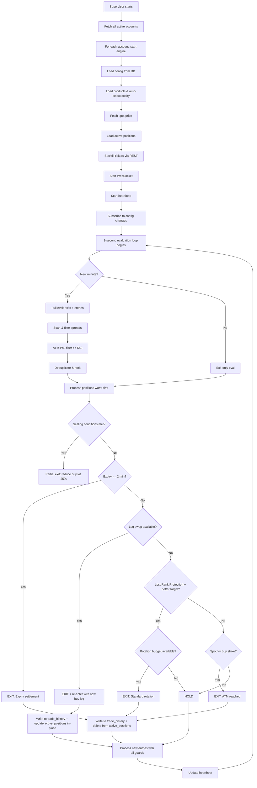

# Paper Trading Engine — Complete Logic Explained

This document explains **every** logic and condition in the Paper Trading engine in the simplest terms possible, from startup to shutdown.

---

## Table of Contents

1. [The Big Picture](#the-big-picture)
2. [Multi-Account Supervisor](#multi-account-supervisor)
3. [Engine Startup (Boot Sequence)](#engine-startup)
4. [The Heartbeat (1-Second Loop)](#the-heartbeat)
5. [How Spreads Are Found (Scanning)](#how-spreads-are-found)
6. [Entry Filters (What Makes a Good Spread)](#entry-filters)
7. [How Entries Are Placed](#how-entries-are-placed)
8. [Exit Priority Tree](#exit-priority-tree)
9. [Partial Exit / Scaling Logic](#partial-exit--scaling-logic)
10. [Leg Swap (In-Place Upgrade)](#leg-swap)
11. [Standard Rotation (Full Replacement)](#standard-rotation)
12. [Safety Guards Summary](#safety-guards-summary)
13. [Config Synchronization](#config-synchronization)

---

## The Big Picture

Think of the engine as a **robot trader** that runs 24/7 on a server. It:

1. Watches live Bitcoin/Ethereum option prices via WebSocket
2. Every **1 second**, checks if any existing positions need to be exited or scaled
3. Every **1 minute**, also looks for new positions to enter
4. Writes everything to a Supabase database so the UI dashboard can display it in real time

The strategy is a **ratio spread** — you buy 1 option (the long/buy leg) and sell multiple options at a different strike (the short/sell leg). The goal is to collect more premium from selling than you pay for buying.

---

## Multi-Account Supervisor

**File**: [paperTradingEngine.js:L1414-L1500](file:///c:/Users/ASUS/Documents/Option_Scope/engine/paperTradingEngine.js#L1414-L1500)

The entry point is `startPaperTradingEngine()`. It acts like a **manager** that:

1. Fetches all active accounts from `paper_trading_accounts` table
2. Starts an **independent engine loop** for each account
3. Listens for account changes in real-time:
   - **New account added** → starts a new engine
   - **Account deactivated** → stops its engine
   - **Account updated** (e.g. name or status changes) → updates the running engine's state

Each account runs in complete isolation — its own WebSocket, its own positions, its own config.

---

## Engine Startup

**File**: [paperTradingEngine.js](file:///c:/Users/ASUS/Documents/Option_Scope/engine/paperTradingEngine.js)

When an engine starts for an account, it runs these steps in order:

| Step | What Happens | Why |
|------|-------------|-----|
| 1 | **Load config** from `paper_trading_config` table (with retries) | Gets filter settings. Retries up to 10 times (500ms delay) to avoid database duplicate key race conditions during concurrent frontend config inserts. |
| 2 | **Load products** from Delta Exchange API | Gets the list of all available option contracts |
| 3 | **Auto-select expiry** if not set or expired | Picks the nearest valid expiry date meeting the `daysToExpiry` threshold |
| 4 | **Fetch spot price** | Gets current BTC/ETH price |
| 5 | **Load active positions** from Supabase | Restores any positions from a previous run |
| 6 | **Backfill tickers** via REST API | Pre-loads option prices so we don't start with empty data |
| 7 | **Start WebSocket** | Connects to Delta Exchange for real-time price streaming |
| 8 | **Start heartbeat** | Writes a "I'm alive" signal to the DB every few seconds |
| 9 | **Subscribe to config changes** | Listens for when you change filters in the UI |

> [!NOTE]
> If no config row exists for this account after the 10-retry loop, the engine **auto-creates one** with default values (BTC, min strike diff 800, etc.).

---

## The Heartbeat (1-Second Loop)

**File**: [paperTradingEngine.js](file:///c:/Users/ASUS/Documents/Option_Scope/engine/paperTradingEngine.js)

After startup, four timers run continuously, all wrapped inside **try-catch** blocks to prevent a failure in one timer from blocking subsequent ticks or other accounts:

| Timer | Interval | Purpose |
|-------|----------|---------|
| **Evaluation loop** | Every 1 second | The core brain — evaluates exits and entries |
| **Spot price poll** | Every 10 seconds | Updates BTC/ETH spot price via REST API |
| **Product refresh** | Every 5 minutes | Refreshes the list of available option contracts |
| **Positions sync** | Every 30 seconds | Re-fetches positions from DB as a safety fallback |

> [!TIP]
> **Real-time Spot updates**: In addition to the periodic REST API fallback poll (every 10 seconds), the engine streams the perpetual contract (`BTCUSD` or `ETHUSD`) directly over the WebSocket ticker stream. This allows the engine to update the underlying spot price instantly as trades occur.

### The Evaluation Loop Decision

Every 1 second, the engine asks: **"Has a new minute started since my last full evaluation?"**

- **Yes** → Run a **full evaluation** (check exits + scan for new entries)
- **No** → Run an **exit-only evaluation** (only check exits, no new entries)

This means:
- **Exits** are checked every **1 second** (fast reaction to price moves)
- **New entries** are checked every **1 minute** (no need to rush entries)

### Pre-Flight Checks & Auto-Healing

Before any evaluation runs, these guards must pass:

1. **`isEvaluating` mutex check** — prevents overlapping evaluations. If the previous run is still active, it skips.
   - *Hang Timeout Guard*: If `isEvaluating` has been active for more than **60 seconds** (e.g. database query is hung indefinitely), the engine logs a fatal error and crashes the process (`process.exit(1)`). This allows PM2 to auto-restart the engine container cleanly.
2. **Spot price exists** — can't evaluate without knowing the underlying price.
3. **Spot not stale** — if the spot price hasn't been updated in **120 seconds**, the evaluation is skipped.
   - *Stale WebSocket Auto-Healing*: When the spot price remains stale for >120 seconds, the engine automatically forces a WebSocket reconnection (`startWebSocket()`) to heal silent TCP drops common on VPS nodes.
4. **Tickers exist** — at least one option price must be in the cache.

---

## How Spreads Are Found (Scanning)

**File**: [utils.js:L73-L147](file:///c:/Users/ASUS/Documents/Option_Scope/engine/lib/utils.js#L73-L147)

The `scanTickers()` function is the **spread finder**. It works like this:

### Step 1: Split options into calls and puts

- **Call tickers** = all calls with strikes **at or above** ATM (At The Money)
- **Put tickers** = all puts with strikes **at or below** ATM

> [!TIP]
> ATM = the strike price closest to the current spot price. If BTC is at $105,000, the ATM strike might be $105,000.

### Step 2: O(N²) pair scan

For each option type, the scanner tries **every possible pair** of options and checks if they form a valid spread. It sorts all tickers by strike price, then pairs each one with every other one.

For **calls**: the lower-strike option is the buy leg, the higher-strike is the sell leg.
For **puts**: the higher-strike option is the buy leg, the lower-strike is the sell leg.

---

## Entry Filters (What Makes a Good Spread)

Every candidate pair must pass **all** of these filters to be considered:

| # | Filter | Config Key | What It Means |
|---|--------|-----------|---------------|
| 1 | **Strike Difference** | `minStrikeDiff` (default: 800) | The two strikes must be at least 800 points apart |
| 2 | **Fresh Quotes** | — (hardcoded 120s) | Both the buy Ask and sell Bid prices must have been updated via WebSocket within the last **120 seconds**. REST-backfilled data (timestamp = 0) is rejected |
| 3 | **IV Difference** | `minIvDiff` (default: 5) | The implied volatility difference between the two options must be ≥ 5% |
| 4 | **Min Long Distance** | `minLongDist` (default: 500) | The buy leg's strike must be at least 500 points away from spot price |
| 5 | **Min Sell Premium** | `minSellPremium` (default: $10) | The sell leg's bid price must be at least $10 |
| 6 | **Ratio Deviation** | `maxRatioDeviation` (default: 0.25) | The premium ratio and delta notional ratio must not deviate by more than 25% |
| 7 | **Max Sell Qty** | `maxSellQty` (default: 10) | The sell quantity (ratio) must not exceed 10 |
| 8 | **Max Net Premium** | `maxNetPremium` (default: $20) | The net premium debit cannot exceed $20 (i.e., `sellQty × sellPrice - buyPrice ≥ -$20`) |
| 9 | **Days to Expiry** | `daysToExpiry` (default: 0) | The option expiry date must be at least this many days away from the current time. Options closer to expiry are rejected. |
| 10 | **Max Calls (#)** | `numberOfCalls` (default: 3) | Maximum active calls allowed concurrently. Also sets call rotation thresholds and call protection slices dynamically. |
| 11 | **Max Puts (#)** | `numberOfPuts` (default: 3) | Maximum active puts allowed concurrently. Also sets put rotation thresholds and put protection slices dynamically. |
| 12 | **ATM Ratio Entry** | `atmRatioScaling` (default: false) | Checkbox toggle to enable scaling of entry sell quantities based on ATM strike option prices. |
| 13 | **Call ATM Pct (%)** | `atmRatioPctCall` (default: 50) | The scaling percentage for ATM ratio adjustments on call spreads. |
| 14 | **Put ATM Pct (%)** | `atmRatioPctPut` (default: 50) | The scaling percentage for ATM ratio adjustments on put spreads. |

### How the Sell Quantity (Ratio) Is Calculated

```
rawQty = buyDeltaNotional / sellDeltaNotional
sellQty = round to nearest 0.25, minimum 1
```

This gives a **delta-neutral** ratio. If the buy leg has 3× the delta notional of the sell leg, you'd sell ~3 contracts.

### After Scanning: ATM PnL Filter

**File**: [paperTradingEngine.js:L315-L360](file:///c:/Users/ASUS/Documents/Option_Scope/engine/paperTradingEngine.js#L315-L360)

After `scanTickers` produces candidates, each one gets an **ATM PnL check**:

> "If we entered this spread now and the price immediately moved to ATM, would we make at least $50?"

This simulates: _What's the profit if spot moves to the buy strike?_ Only spreads with ATM PnL ≥ $50 survive.

### Deduplication & Ranking

1. Group by buy strike — if multiple spreads share the same buy strike:
   - Keep the one with the **highest ROI** (primary candidate, essential for Leg Swaps).
   - If this highest ROI candidate conflicts with any of your currently active positions (other than itself), ALSO keep the next best **non-conflicting fallback candidate** for that same buy strike (if one exists). This allows normal entries to execute on non-conflicting spreads even when the primary highest ROI spread is blocked by active positions.
2. Sort by **distance to ATM** (closest first)
3. Take the top **10 calls + 10 puts** maximum (or higher if the configured `numberOfCalls`/`numberOfPuts` is set to more than 10, ensuring candidates always cover your max limits).

> [!IMPORTANT]
> **Why we keep both the primary (potentially conflicting) and fallback (non-conflicting) candidates:**
> - **Leg Swaps** require candidates that share the **same sell strike** as an active position. Since this sell strike is already active, the candidate will naturally trigger a "sell strike conflict" check. If we filtered out conflicting candidates before grouping, we would never find candidate upgrades for Leg Swaps.
> - **Normal Entries** require candidates that do **not** conflict with any active position strikes. If we only kept the highest ROI candidate per buy strike and it had a conflict, we would be locked out of entering any trades for that buy strike even if other non-conflicting spreads on that strike existed.
> - **The Solution**: We keep the primary highest-ROI candidate (preserving it for Leg Swaps) *and* dynamically append the next best non-conflicting fallback candidate for the same buy strike (enabling normal entries). This prevents trade lockouts.

---

## How Entries Are Placed

**File**: [paperTradingEngine.js](file:///c:/Users/ASUS/Documents/Option_Scope/engine/paperTradingEngine.js)

Once we have the filtered, ranked list of candidate spreads (`uniqueTopSpreads`), the engine tries to open new positions. Each candidate must pass these checks **in order**:

### Guard 1: Expiry Buffer
```
If less than 5 minutes until expiry → SKIP
```
No point entering a trade that's about to expire.

### Guard 2: Days to Expiry Guard
```
If daysRemaining < daysToExpiry → SKIP
```
Requires the option's expiry to be at least `daysToExpiry` days away from the current time.

### Guard 3: Buy Strike Conflict (Local)
```
If any existing or newly-staged position already has this buy strike → SKIP
```
Prevents duplicate buy strikes within the same option type.

### Guard 4: Sell Strike Conflict (Local)
```
If any existing or newly-staged position already has this sell strike → SKIP
```
Prevents duplicate sell strikes within the same option type.

### Guard 5: Portfolio Cap (Local)
```
If there are already `config.numberOfCalls` (for calls) or `config.numberOfPuts` (for puts) active positions of this type → SKIP
```
Maximum **config.numberOfCalls calls + config.numberOfPuts puts** per account (defaulting to 3 each).

### Guard 6: ATM Ratio Scaling (Optional)
If `atmRatioScaling` is enabled in config:
```
liveAtmRatio = ATM buy price / ATM sell price
diff = max(0, liveAtmRatio - baseRatio)
adjustedRatio = baseRatio + (pct% × diff)
```
This lets you capture a percentage (e.g. 50%) of the extra ratio available at ATM strikes.

### Guard 7: $200K Short Value Cap
```
shortValue = spotPrice × sellQty × sellLotSize
If shortValue ≥ $200,000 → scale down both lot size and sell qty proportionally
```
Ensures no single position has more than $200K notional exposure on the short side.


### Guard 8: DB-Level Count Guard
```
Query: SELECT count(*) FROM active_positions WHERE type = X AND account_id = Y
If count ≥ `config.numberOfCalls` (for calls) or `config.numberOfPuts` (for puts) → BLOCK
```
Double-check against the **database** (not just local memory) to prevent race conditions.

### Guard 9: DB-Level Buy Strike Uniqueness
```
Query: SELECT * FROM active_positions WHERE buy_strike = X AND type = Y AND account_id = Z
If exists → BLOCK
```

### Guard 10: DB-Level Sell Strike Uniqueness
```
Query: SELECT * FROM active_positions WHERE sell_strike = X AND type = Y AND account_id = Z
If exists → BLOCK
```

> [!IMPORTANT]
> Guards 8-10 are **database-level guards** that act as a second safety net. Even if the in-memory checks pass, the DB checks can still block an entry. This prevents duplicate positions if two evaluation cycles overlap or if the engine restarts.

### Entry Pricing

- **Buy price** = the live **Ask** (you're buying, so you pay the asking price)
- **Sell price** = the live **Bid** (you're selling, so you receive the bid price)

This is **execution-realistic** — no cheating with mid-prices.

---

## Exit Priority Tree

**File**: [paperTradingEngine.js:L420-L1022](file:///c:/Users/ASUS/Documents/Option_Scope/engine/paperTradingEngine.js#L420-L1022)

When evaluating exits, positions are processed in a specific order: **worst-first** (farthest from ATM). This ensures we exit the least valuable positions before the best ones.

For each position, the engine walks through this **priority tree** from top to bottom. The first matching condition triggers the exit:

```
┌─────────────────────────────────────────────┐
│         For each position (worst-first):     │
│                                              │
│  1. Data gap? (no live quotes)               │
│     → SKIP (keep position, can't evaluate)   │
│                                              │
│  2. Partial Exit / Scaling?                  │
│     → Scale down buy leg if profitable       │
│     (does NOT exit the position)             │
│                                              │
│  3. PRIORITY 2: Expiry?                      │
│     → EXIT if ≤ 2 minutes to expiry          │
│                                              │
│  4. PRIORITY 4: Leg Swap available?          │
│     → EXIT + re-enter with better buy leg    │
│                                              │
│  5. PRIORITY 4: Standard Rotation?           │
│     → EXIT if not protected + better exists  │
│                                              │
│  6. PRIORITY 3: ATM reached?                 │
│     → EXIT if spot crosses buy strike        │
│                                              │
│  7. None of the above                        │
│     → HOLD (keep position)                   │
└─────────────────────────────────────────────┘
```

> [!NOTE]
> The priority numbering (2, 3, 4) comes from the code comments. Priority 1 was removed (time-based exit). The check order in code is: Scaling → Expiry → Rotation/LegSwap → ATM.

### Exit: Expiry Settlement

```
If current time ≥ expiry time - 2 minutes → EXIT
```

We exit **2 minutes early** to avoid settlement mechanics. If a position somehow wasn't exited and it's been more than **10 minutes past expiry**, it's treated as a "zombie" and force-exited with the expiry time as the recorded exit time.

### Exit: ATM Reached

```
For CALLS: if spotPrice ≥ buyStrike → EXIT
For PUTS:  if spotPrice ≤ buyStrike → EXIT
```

When the spot price reaches or crosses your buy leg's strike, the position has hit its maximum theoretical profit zone. Time to lock it in.

---

## Partial Exit / Scaling Logic

**File**: [paperTradingEngine.js:L439-L661](file:///c:/Users/ASUS/Documents/Option_Scope/engine/paperTradingEngine.js#L439-L661)

This is the most complex part. Think of it as **gradually taking profit** by reducing the buy leg's lot size in steps while keeping the short leg untouched.

### The Concept

Imagine you entered with a lot size of 1.0 on the buy leg. As the position becomes more profitable, the engine **shaves off 25% of the initial lot size** at each step:

```
Start:  lotSize = 1.00
Step 1: lotSize = 0.75  (shaved off 0.25)
Step 2: lotSize = 0.50  (shaved off another 0.25)
STOP:   Can't go below 0.50 (50% floor of initial scaled lot size)
```

### Three Conditions Must ALL Be True to Scale

| Condition | Formula | Meaning |
|-----------|---------|---------|
| **PnL threshold** | `currentGrossPnl ≥ checkpointPnl + (checkpointAtmPnl × 25%)` | The position's gross profit must exceed the last checkpoint plus 25% of the ATM P&L |
| **Floor limit** | `hypotheticalLotSize ≥ floorLimit (50% of initial)` | Can't reduce below 50% of the initial scaled lot size |
| **ATM ratio guard** | `liveAtmRatio ≥ recalculatedRatio + 1` | The live ATM ratio must be at least 1 higher than what the ratio would become after scaling |

### What Happens When It Scales

1. A **partial exit trade** is recorded in `trade_history` with `is_partial = true`.
2. The buy leg's `lotSize` is reduced by `deltaBuyQty` (25% of initial).
3. The `checkpointPnl` and `checkpointAtmPnl` are **reset** to current values (this raises the bar for the next scaling step).
4. **Accurate & Symmetrical Fee Calculations**: 
   - **Entry Fee (`partialEntryFee`)**: Calculated exactly for the exited buy leg portion using the entry parameters: `calculateFee(pos.entryBuyPrice, pos.entrySpotPrice, deltaBuyQty, pos.buyLeg.originalLotSize || 1)` (capped to the remaining entry fee). This avoids scaling down the total entry fee proportionally (which would incorrectly deduct a portion of the Sell Leg's entry fee while it is still open).
   - **Exit Fee (`partialExitFee`)**: Calculated dynamically based on the current live exit price and spot: `calculateFee(liveExitBuy, spotPrice, deltaBuyQty, pos.buyLeg.originalLotSize || 1)`.
5. The process **repeats in a while loop** — multiple scaling steps can happen in a single evaluation if the price moved a lot.

### Key Fields

| Field | Meaning |
|-------|---------|
| `originalLotSize` | The lot size before any `$200K` cap scaling was applied |
| `initialScaledLotSize` | The lot size after the `$200K` cap at entry (this is the "100%" baseline) |
| `lastCheckpointPnl` | The gross PnL at the last scaling event |
| `lastCheckpointAtmPnl` | The ATM PnL at the last scaling event |
| `accumulatedSellPnl` | ⚠️ Misleading DB column name — actually stores accumulated **buy leg** partial exit PnL |

---

## Leg Swap

**File**: [paperTradingEngine.js:L708-L763](file:///c:/Users/ASUS/Documents/Option_Scope/engine/paperTradingEngine.js#L708-L763)

A leg swap is an **in-place upgrade** of the buy leg while keeping the sell leg the same.

### When Does It Happen?

A leg swap fires when a **better buy strike** is available at the **same sell strike**:

```
Current position: BUY 108000 / SELL 110000 (Call)
Better candidate: BUY 106000 / SELL 110000 (Call)  ← closer to ATM = better
→ Leg Swap: replace buy 108000 with buy 106000
```

### Leg Swap Conditions (ALL must pass)

| # | Condition | Meaning |
|---|-----------|---------|
| 1 | Same sell strike | The candidate's sell leg must match the existing position's sell strike exactly |
| 2 | Better buy strike | For calls: new strike < old strike. For puts: new strike > old strike (closer to ATM) |
| 3 | No conflicts | New buy strike isn't used by any other active position |
| 4 | **No net debit** | `netPremiumSwap ≥ 0` — the swap must not cost money. Formula: `(deltaQty × sellPrice) - (newBuyPrice - oldBuyBid)` |
| 5 | **Spot step valid** | Spot must have moved at least 0.5% from the entry spot price (rounded to nearest 100) |

### What "No Net Debit" Means

```
netPremiumSwap = (change in sell qty × sell price) - (new buy ask - current buy bid)
```

- If positive → you **receive** money in the swap (good)
- If zero → break-even swap (acceptable)
- If negative → you **pay** money to swap (REJECTED)

### Leg Swap Execution

When a leg swap fires:

1. The **old buy leg** is "exited" → recorded in `trade_history` (PnL is only the buy leg's profit).
   - **Entry Fee (`longEntryFee`)**: The entry fee allocated to the exited buy leg is calculated exactly based on its initial entry parameters: `calculateFee(pos.entryBuyPrice, pos.entrySpotPrice, pos.buyLeg.lotSize, pos.buyLeg.originalLotSize || 1)` (capped to `pos.entryFee`). This prevents allocating any of the Sell Leg's entry fee to the exited Buy Leg.
2. The **sell leg stays untouched** (no exit fee on the sell side).
3. The position is **updated in-place** in `active_positions` with the new buy leg.
4. If the sell quantity changes (due to different delta notional ratios), the sell entry price is **weighted-averaged**.
5. The new active entry fee is updated as: `(pos.entryFee - longEntryFee) + newLongEntryFee + shortAdjustmentFee`, perfectly preserving the Sell Leg's initial entry fee.

---

## Standard Rotation

**File**: [paperTradingEngine.js:L764-L820](file:///c:/Users/ASUS/Documents/Option_Scope/engine/paperTradingEngine.js#L764-L820)

A standard rotation is a **full replacement** — both legs are exited and a new spread is entered.

### When Does It Happen?

Only when **all** of these are true:

1. **Full Evaluation Cycle**: The current run is a full evaluation cycle (`onlyExits = false`), ensuring the entry code runs in the same tick and processes the replacement immediately.
2. The position is **NOT in the top protected** ranked spreads for its type (`config.numberOfCalls` for calls, `config.numberOfPuts` for puts).
3. A better target exists (closer to ATM, no strike conflicts).
4. **Rotation budget available**: at least `config.numberOfCalls` (for calls) or `config.numberOfPuts` (for puts) active positions of this type exist, and fewer than `maxCallRotations`/`maxPutRotations` rotations have happened this cycle.
5. The spot step guard passes (0.5% movement from entry).
6. If the target happens to share the same sell strike, the net premium swap must be ≥ 0.
7. **No DB Strike Conflicts**: A pre-exit query checks Supabase to ensure the replacement target's strikes do not conflict with existing active positions. If a conflict is found, the exit is aborted.

### Rotation Budget

The maximum number of rotations per cycle is dynamic and equals the configured portfolio cap for each option type:
- Calls: Max rotations per cycle = `config.numberOfCalls`
- Puts: Max rotations per cycle = `config.numberOfPuts`

Can rotate? = (active positions of this type ≥ config.numberOfCalls/Puts) AND (rotations this cycle < maxCallRotations/maxPutRotations)

This prevents the engine from churning through all positions in a single minute. At most **config.numberOfCalls calls and config.numberOfPuts puts** can rotate per evaluation cycle.

### What "Not in Protected Rank" Means

After scanning and ranking all candidate spreads by distance-to-ATM, the engine takes the top-ranked spreads by type up to the configured limit (**config.numberOfCalls** for calls, **config.numberOfPuts** for puts). If a position's buy strike appears in this top list, it's **protected** from rotation. If not, it's eligible to be replaced.

---

## Safety Guards Summary

Here's every safety guard in one table:

| Guard | Where | Purpose |
|-------|-------|---------|
| `isEvaluating` mutex | `paperTradingEngine.js` | Prevents overlapping evaluation cycles |
| Spot staleness (120s) | `paperTradingEngine.js` | Skips evaluation if spot price is stale |
| WebSocket stale spot reconnect | `paperTradingEngine.js` | Automatically forces WebSocket reconnect (`startWebSocket()`) if spot remains stale > 120s |
| Evaluation hang guard (60s) | `paperTradingEngine.js` | Logs fatal error and crashes process (`exit(1)`) if evaluation is hung > 60s, triggering PM2 container recovery |
| Config fetch retry loop (10x) | `paperTradingEngine.js` | Retries config load up to 10 times with 500ms delay to prevent duplicate key database insert collisions |
| Quote freshness (120s) | `utils.js` | Rejects spread candidates with stale WS quotes |
| Backfill rejection (timestamp = 0) | `utils.js` | Rejects REST-backfilled data that has no real timestamp |
| Min strike diff | `utils.js` | Minimum distance between buy and sell strikes |
| Min IV diff | `utils.js` | Minimum implied volatility gap |
| Min long distance | `utils.js` | Buy leg must be far enough from spot |
| Min sell premium | `utils.js` | Sell leg must have meaningful premium |
| Ratio deviation | `utils.js` | Premium ratio must roughly match delta notional ratio |
| Max sell qty | `utils.js` | Caps the short side quantity |
| Max net premium debit | `utils.js` | Limits how much net debit is acceptable |
| ATM PnL ≥ $50 | `paperTradingEngine.js` | Only enters spreads that would profit $50+ at ATM |
| Days to Expiry | `paperTradingEngine.js` | Rejects candidates whose expiry is fewer than `daysToExpiry` days away |
| Portfolio cap | `paperTradingEngine.js` | Max calls (`config.numberOfCalls`) and puts (`config.numberOfPuts`) per account |
| $200K short value cap | `paperTradingEngine.js` | Scales down lot sizes if short notional ≥ $200K |
| DB count guard | `paperTradingEngine.js` | Database-level check: max `config.numberOfCalls` calls / `config.numberOfPuts` puts |
| DB buy strike uniqueness | `paperTradingEngine.js` | Database-level: no duplicate buy strikes |
| DB sell strike uniqueness | `paperTradingEngine.js` | Database-level: no duplicate sell strikes |
| Expiry buffer (5 min) | `paperTradingEngine.js` | Won't enter if less than 5 minutes to expiry |
| Scaling floor (50%) | `paperTradingEngine.js` | Buy lot size can never go below 50% of initial |
| Scaling ATM ratio guard | `paperTradingEngine.js` | Live ATM ratio must justify the lot reduction |
| Leg swap no-debit | `paperTradingEngine.js` | Leg swaps that cost money are rejected |
| Spot step (0.5%) | `paperTradingEngine.js` | Rotation/swap requires spot to have moved ≥ 0.5% (rounded to nearest 100) |
| Rotation budget | `paperTradingEngine.js` | Max rotations per type per evaluation cycle (`config.numberOfCalls` for calls, `config.numberOfPuts` for puts) |
| `lastDbWrite` cooldown (3s) | `paperTradingEngine.js` | Skips position refetch for 3s after a DB write |
| Heartbeat timer delete | `paperTradingEngine.js` / `heartbeat.js` | Clears interval timer and deletes the DB row on account deletion to prevent zombie row resurrection |

---

## Config Synchronization

**File**: [paperTradingEngine.js:L1279-L1312](file:///c:/Users/ASUS/Documents/Option_Scope/engine/paperTradingEngine.js#L1279-L1312)

When you change filters in the UI and click **Apply**:

1. The UI writes the new config to `paper_trading_config` in Supabase
2. Supabase Realtime fires a `postgres_changes` event
3. The engine's `subscribeConfigChanges` listener catches it
4. It re-reads the config from the DB
5. If the **underlying or expiry changed**, it also:
   - Refreshes products
   - Re-fetches positions
   - Clears the ticker cache
   - Restarts the WebSocket with new symbols
   - Backfills tickers for the new symbols

When you click **Reset**:

1. The UI loads the account-specific defaults stored in the active account's `default_config` JSONB column. (If the account is a legacy account without custom defaults, it falls back to system factory defaults).
2. It merges these default parameters with the current asset/expiry.
3. Immediately upserts those defaults to Supabase.
4. The same Realtime listener picks it up and reloads the config.

### Tab Synchronization
- Changes are synchronized across browser tabs in real-time using a local broadcast channel (`CONFIG_SYNC` event).
- To prevent database write loop collisions, receiving tabs update only their local React state buffers and do **not** trigger redundant database writes, preserving the correct, newly applied configuration.

---

## Lifecycle Flow Diagram



---

## Quick Reference: Key Numbers

| Constant | Value | Meaning |
|----------|-------|---------|
| Evaluation interval | 1 second | How often the main loop runs |
| Entry scan interval | 1 minute | How often new entries are considered |
| Spot poll interval | 10 seconds | How often spot price is fetched via REST |
| Product refresh | 5 minutes | How often the option chain is refreshed |
| Position sync | 30 seconds | How often positions are re-fetched from DB |
| Spot staleness limit | 120 seconds | Max age of spot price before skipping eval |
| Quote freshness limit | 120 seconds | Max age of option quotes for entry |
| Expiry exit buffer | 2 minutes | How early before expiry to force-exit |
| Zombie threshold | 10 minutes | Past expiry, use expiry time as exit time |
| Max positions per type | Configurable | Max calls (`config.numberOfCalls`) or puts (`config.numberOfPuts`) per account (default: 3) |
| Max rotations per cycle | Configurable | Max rotations per type per eval cycle (`config.numberOfCalls` for calls, `config.numberOfPuts` for puts) |
| $200K cap | $200,000 | Max short notional value |
| Scaling step | 25% | Lot size reduction per scaling event |
| Scaling floor | 50% | Minimum lot size as % of initial |
| ATM PnL minimum | $50 | Min simulated ATM profit for entry |
| Spot step threshold | 0.5% | Min spot movement for rotation/swap (rounded to nearest 100) |
| ATM strike tolerance (BTC) | 500 points | Fallback tolerance for finding ATM prices |
| ATM strike tolerance (ETH) | 50 points | Fallback tolerance for finding ATM prices |
| Evaluation hang limit | 60 seconds | Max duration evaluation can run before process is restarted |
| Days to Expiry | User configured | Minimum days to expiry required for new spreads |
